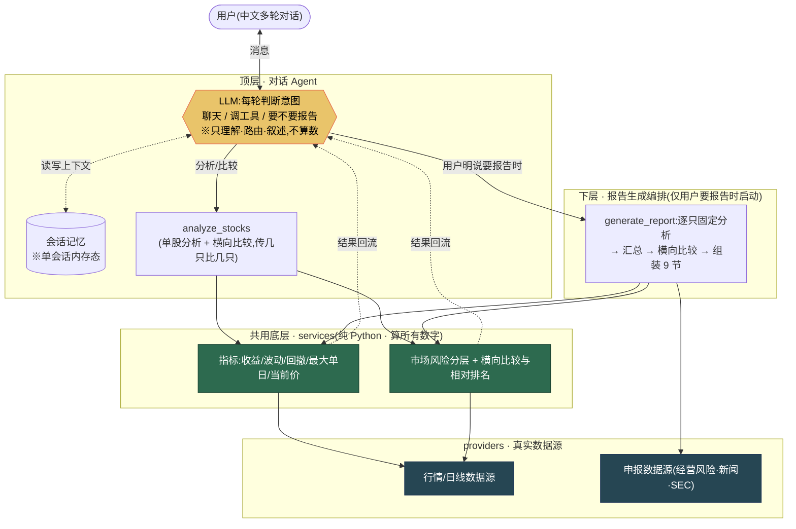
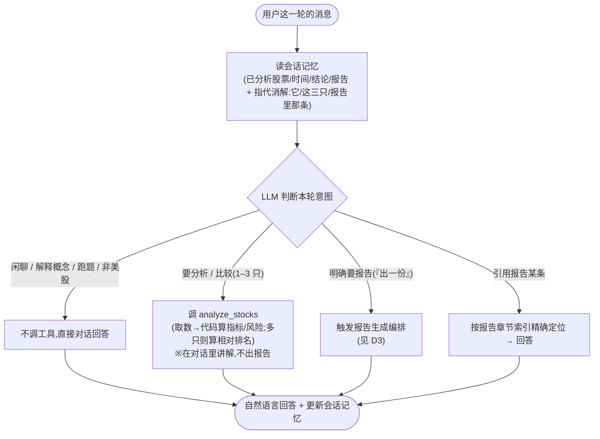
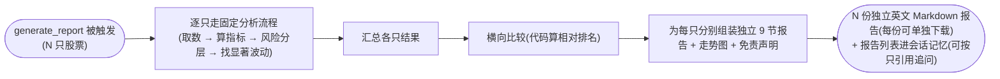

# 对话式美股研究 Agent — 产品需求文档（PRD）

> **SDD「Specify」阶段产物**。本文是后续开发的需求基线。
> **只描述「做什么」与产品边界**；数值公式、目录结构、运行时拼装等实现细节留给 spec / plan，不写进本文。
> 版本：两层架构定稿版 v6（2026-06-08）。**本版统一并替换此前两个极端版本**——既不是「只有一条重报告流水线」，也不是「只有一个轻量对话壳」，而是**上下两层、共用一套确定性内核、报告按需触发**。

---

## 一句话产品定义

> 一个**对话式美股研究 Agent**:用户和它正常多轮对话;它能取真实股票数据、用人话讲解、做**单股分析**与**横向比较**;当用户**明确要报告**时,启动一条**结构化编排流程**产出详细英文报告,用户还能**引用报告内容继续追问**。本产品是**研究辅助,不构成投资建议**。

---

## 0. 阅读指引：两层架构,不冲突（全文围绕这一点）

本产品是**上下两层、共用一套确定性分析内核**的系统。请先记住这张「上下两层」心智图,后面所有章节都围绕它展开。

| 层 | 是什么 | 平时干什么 | 何时启动 |
|---|---|---|---|
| **顶层 · 对话 Agent** | LLM + 会话记忆 + 一个轻量分析工具 | 闲聊、解释概念、**单股分析**、**横向比较**——**都在对话里直接完成,这时不出报告** | 每一轮对话 |
| **下层 · 报告生成编排** | 一条结构化编排流程(逐只固定分析 → 汇总 → 比较 → 组装 9 节) | 平时**不运行** | **仅当用户明确要报告时**才启动 |
| **共用 · services 内核** | 指标 / 风险 / 比较的**确定性计算**(数字全由代码算) | 被上下两层**共同复用** | 两层都依赖它 |

**关键三句话(贯穿全文):**

1. **对话归对话,报告归编排**——两者是上下两层、各司其职。
2. **报告按需触发**——不是每轮强制出报告,也**不是把报告砍掉**;是「用户要报告时才启动那条编排」。
3. **数字全代码算**——无论在对话里还是在报告编排里,所有量化结论都来自同一套 services 纯代码,LLM 只理解 / 路由 / 叙述。

**与此前两个极端版本的根本区别:**

- **不是 旧版 A**(「一提股票就跑完整流水线、强制每轮吐一份 9 节报告」):那是「报告是主线、对话是壳」。本版里**报告只在被明确要求时**才进入下层编排。
- **不是 旧版 B**(「只有一个轻对话壳、把报告整块砍掉」):本版**保留了报告生成编排**(原架构),只是把它降为「按需启动的下层」,而不是「每轮必经」。

> 一句话:**被砍掉的是「每轮强制出报告」这件事;被保留的是「报告生成编排」这套能力**——两者不是一回事。

---

## 1. 产品定义与范围分层

### 范围分层

| 层 | 内容 | 定位 |
|---|---|---|
| **核心 · 对话** | 自由多轮对话 + 每轮意图识别 + 单会话记忆 + 把数据用人话讲清楚 | 产品主体,所有体验的承载 |
| **核心 · 单股分析 + 横向比较** | 识别公司 → 取行情/日线 → **代码算指标与市场风险**;传入多只时**横向比较与相对排名**——**都在对话里完成,不出报告** | 顶层对话调用的「专业内核入口」 |
| **核心 · 报告生成编排(要报告时)** | 用户明说要报告时,启动结构化编排:逐只固定分析 → 汇总 → 横向比较 → 为**每只股票**分别产出一份独立英文 9 节报告(含走势图、完整免责声明,可下载);一次请求多只时产出多份报告;会话报告列表累积 | **下层,按需触发**;非每轮强制 |
| **核心 · 引用报告** | 报告进会话记忆;用户能引用报告里某节某条(「阿里第二条风险」)继续追问,精确定位不串台 | 报告与对话的衔接 |
| **核心 · 上传财报文件并基于它问答** | 用户上传一个财报文件（PDF/TXT/MD，单文件，再传即替换）→ Agent 基于文档原文回答，先简述文件内容再回答问题；文档问题复用现有流式分阶段进度 UI（`__doc__` 轨）；严格基于文档引用，缺失说「文档中未提及」，不编造 | **按需触发**（有上传时才激活） |
| **明确不做** | 账号/登录/跨会话历史/刷新恢复;交易/买卖建议/目标价/估值/仓位;**OCR**（扫描件诚实报错，不支持）/向量数据库服务/独立 RAG 服务;A 股/港股/加密/OTC;多用户 | 超出当前范围或会损害核心链路 |

> **核心理念(贯穿全文)**:只凭近期股价,系统**只能判断「观察到的市场价格风险(Observed Market Risk)」,不能判断整家公司的综合投资风险**。所有量化结论都分层、规则化、可追溯;**模型只理解 / 路由 / 叙述,绝不算数、不编概率、不断因果**。

---

## 2. 目标用户与典型对话脚本

**目标用户**:看得懂涨跌、但不会自己算波动/回撤、不会读财报、也没空逐条翻新闻的研究型用户。他们要的是**像和一个懂行的朋友聊天**——问一句,得到带真实数据、讲得清、还记得上文的回答;需要时再要一份正式报告。

下面是 **5 段真实对话脚本**(**用户中文聊天,报告产物英文**)。每段标注 **Agent 何时在后台调了哪个工具**。注意贯穿其中的两件事:**(a) 不是每轮都调工具**(脚本 a 纯聊);**(b) 不是每轮都出报告**——**单股分析和横向比较都在对话里直接做,只有脚本 d 那一刻才触发报告编排**。

---

**脚本 a · 闲聊 / 「你能干嘛」(不调任何工具,不出报告)**

> **用户**:你好,你是干什么的?
>
> **Agent**:你好!我是一个美股研究助手。你可以直接用大白话问我,比如「英伟达最近三个月表现怎么样」「帮我把苹果和谷歌的风险比一比」。我会去取真实行情、用代码算好风险指标,再用人话讲给你听。需要的话,我还能给你出一份正式的英文研究报告。提醒一句:我做的是**研究参考,不是投资建议**,也不会给你目标价或买卖建议。想从哪只股票开始?
>
> *(后台:本轮判断为闲聊/自我介绍,**不调用任何工具**,直接对话回答。)*

---

**脚本 b · 「分析下英伟达」 → 调 `analyze_stocks`(单只) → 人话讲指标与风险(不出报告)**

> **用户**:帮我分析下英伟达最近三个月。
>
> **Agent**:好的,我去取一下英伟达(NVIDIA · NVDA · 纳斯达克)最近三个月的行情来算一算。
> *(后台:Agent 判断需要数据 → 调用 **`analyze_stocks(companies=["英伟达"], period="近三个月")`**:识别公司 → 取行情/日线 → **代码算**区间收益、波动、回撤、最大单日、当前参考价 → 给市场风险等级。**这一步不出报告**。)*
> 这三个月里,NVDA 区间收益大约 **−10.4%**(从期初到期末跌了约一成)。波动不算小:年化波动率约 **42%**,期间最大回撤约 **−13.8%**(从最高收盘价到之后最低点的最大跌幅)。按我这边的规则,它当前的「**已观察市场风险(Observed Market Risk)**」是 **Medium**。要强调:这个判断**只看了股价本身**,反映的是这段时间的波动和回撤,**不等于这家公司整体的投资风险**(那还要看财务、估值,我这一步没算)。想顺便看看跌得最凶那天前后发生了什么吗?

---

**脚本 c · 「把阿里、英特尔加进来比比」 → 调 `analyze_stocks`(传 3 只) → 相对排名(仍不出报告)**

> **用户**:那把阿里和英特尔也加进来,这三只一起比比,谁风险更高?
>
> **Agent**:好,我把阿里巴巴(BABA · 纽交所,**注意是美股 ADR,不是港股 9988**)和英特尔(INTC · 纳斯达克)按同样的最近三个月、同样口径一起算,然后横向比较。
> *(后台:Agent 调用 **同一个工具** `analyze_stocks(companies=["英伟达","阿里巴巴","英特尔"], period="近三个月")`——**单股分析和横向比较是同一个工具,传几只就比几只**;**代码**对三只统一算指标 + 算相对排名。**这一步仍不出报告**。)*
> 三只放一起(**相同区间、相同算法**)比下来:这段时间 **NVDA 的相对市场风险最高**,其次 BABA,INTC 相对最低。要强调一点——这个排名**只在你这次选的这三只之间、这段时间内成立**,不代表全市场或更长周期。要不要我把这三只都讲清楚、出一份英文报告?

---

**脚本 d · 「出一份报告」 → 这一刻才触发报告生成编排 → 英文 9 节报告可下载**

> **用户**:好,出一份报告吧。
>
> **Agent**:好的,我基于刚才这三只(NVDA / BABA / INTC,最近三个月)分别生成三份英文研究报告,每只一份。
> *(后台:**只有这一刻**,Agent 才调用 **`generate_report(...)`**,**启动下层报告生成编排**——逐只走固定分析流程 → 汇总 → 横向比较 → 为**每只股票**分别组装一份独立的 9 节英文 Markdown 报告(含归一化走势、市场风险、相关事件、短期市场观点、证据与限制、英文免责声明、走势图);三份报告各自可独立下载;报告列表进会话记忆。**注意:前面 b、c 两轮都没出报告,直到这一句才进入报告编排。**)*
> 报告已生成,共三份(NVDA / BABA / INTC 各一份),可在报告列表里选择查看,每份均可单独下载(Markdown)。每份报告内含 9 个部分:公司快照、价格走势(含归一化走势图,基准=100)、已观察市场风险(含该只在本次批次内的相对排名)、显著波动、相关事件(带方向和归因置信度)、财务与申报亮点、经营风险、短期市场观点、证据与限制。所有结论都标了来源和数据时间,也写明「不构成投资建议」。想细看哪份哪部分,直接问我。

---

**脚本 e · 「报告里阿里第二条风险细说」 → 引用报告精确定位作答(不串台)**

> **用户**:报告里阿里第二条经营风险,具体说的是啥?
>
> **Agent**:你说的是报告里 **Alibaba(BABA)** 那节「Business Risks」的**第 2 条**。
> *(后台:Agent 把这句理解成对报告特定章节的**引用**(owner=BABA、section=Business Risks、第 2 条),通过**报告章节索引**精确定位到那一条,**不会拿成英伟达的、也不会编**。)*
> 那一条讲的是「监管 / 地缘相关风险」,大意是……[复述该条要点],来源是它最新一份申报里的对应条目(我标了链接/页码)。需要我把这一类风险展开,或者和英伟达对应的风险对比一下吗?

---

---

**脚本 f · 上传财报文件 → 文档解读分阶段进度 → 先总结再回答（复用现有流式 UI）**

> **用户**:（上传 `NVDA_2026Q1_10K.pdf`）帮我分析下这个财报里的主要风险。
>
> **Agent**:好的，我来读取并解析这份文件。
> *(后台：Agent 判断用户问及已上传文档 → 调用 **`analyze_document(question="帮我分析下这个财报里的主要风险")`**；前端在现有流式 UI 里展示 `📄 NVDA_2026Q1_10K.pdf · 文档解读` 轨：`读取文件 → 解析内容 → 定位相关内容 → 理解并汇总`，逐阶段点亮。**这是对现有流式进度 UI 的复用，非新造一套。**)*
>
> 这份文件是 **NVIDIA 2026 财年 Q1 10-K 年报**，共约 220 页，主要涵盖公司业务概述、财务数据、风险因素和管理层讨论。
>
> 关于主要风险，文档中提到的核心风险包括：①出口管制与地缘政治限制（文档第 23 页原文：「…export control regulations…」）；② 数据中心需求高度集中于少数大客户；③ 供应链依赖台积电等外部代工厂……（均基于文档原文引用，带定位信息）。提醒：这是**文档原文的定性解读**，财报中的具体财务数字指标（如 EPS、营收增速）若需要结合真实行情，请另行告知，我可以去取真实数据分析。

---

> **这 5+1 段脚本共同点明的产品性格:**
> 1. **不是每轮调工具**(脚本 a 纯聊);**不是每轮出报告**(只有脚本 d 才出)。
> 2. **比较在对话里就能做**(脚本 c):单股分析与横向比较是**同一个工具,传几只比几只**,**不需要先出报告**。
> 3. **报告是按需编排**(脚本 d):用户明说「出一份」那一刻,才启动下层编排。
> 4. **记得上文**:脚本 c 的「这三只」、脚本 e 的「报告里阿里那条」,都靠会话记忆消解。
> 5. **诚实**:风险口径讲清边界(脚本 b),排名标注范围(脚本 c),引用走索引不串台(脚本 e)。

---

## 3. 三条不可动摇原则 + 不构成投资建议

> 这是产品的「人格底线」,任何对话与报告都不得违背(与项目根本大法一致)。

1. **数字交给代码,模型只解释** —— 所有量化(收益、波动、回撤、风险分数、相对排名、来源分级……)由**确定性纯 Python 代码**算;**LLM 绝不参与任何算术或置信度打分**,只负责理解用户、路由到工具、把结果用自然语言讲出来。无论在对话层还是在报告编排层,**用的是同一套 services 内核**。
2. **只摆证据与相关性,绝不断言因果** —— 事件只说「**可能相关**」「时间接近,可能是因素之一」;证据不足就说「**当前公开证据不足以确认原因**」;**绝不**写「这条新闻导致了下跌」,**绝不**编造涨跌原因或缺失数据。
3. **来源 / 数据时间 / 新鲜度透明** —— 每个数字、结论、事件都带来源、数据时间、新鲜度;走势/指标基于**已完成日线**(来源 **Yahoo Finance**,延迟/非实时,截至最近交易日),当前价是「**延迟参考价、不用于交易**」必须讲清。
4. **不构成投资建议(免责)** —— **不输出买卖指令、目标价、估值、收益承诺、仓位建议**;对话与报告始终带「研究参考、非投资建议」的态度,正式报告含**英文逐字免责声明**(见 §9)。

---

## 4. 总体架构（D1 · 两层架构总览）

用户与**顶层对话 Agent**多轮对话;Agent 平时用一个**轻量分析工具 `analyze_stocks`** 做单股分析与横向比较(**在对话里完成,不出报告**);**只有用户要报告时**,才经 `generate_report` **启动下层的报告生成编排**(逐只分析 → 汇总 → 比较 → 组装 9 节)。**上下两层共用底层 services(代码算数)+ providers(真实数据源)。** 图上**用颜色标清:哪些框算数字(代码,绿),哪些只叙述/路由(LLM,黄)**。

**读图要点(一眼看懂):**
- **上下两层**:顶层是对话 Agent(平时只用 `analyze_stocks` 做分析/比较);下层是报告生成编排(`generate_report`,**只有用户要报告时才启动**)。
- **共用内核**:绿色 services 是**唯一算数字**的地方,被上下两层**共同复用**;黄色 LLM 只判意图、路由、叙述,**不碰算术**。
- **按需触发**:从 LLM 到下层编排那条线,标注「用户明说要报告时」——**平时不走这条线**。

---

## 5. 运作机制（D2 单轮三分叉 + D3 报告编排内部流程）

**核心机制:每一轮,LLM 临场决定走哪条**——看用户这句话,判断是「闲聊」「要分析/比较」还是「要报告」,再决定调不调工具、调哪个。**报告只在被明确要求时进入下层编排,绝不是每轮必经。**

### D2 · 单轮生命周期(三分叉:闲聊 / 分析 / 报告)

> **D2 强调**:**三条分叉并存**——闲聊直接答 / 需要数据走 `analyze_stocks` 讲解(**不出报告**)/ 明确要报告才进入下层编排。**每轮走哪条由 LLM 临场判断**,这正是与「强制每轮出报告」的分水岭。**横向比较走的是「分析」那条**(同一个 `analyze_stocks` 传多只),**不必先出报告**。

### D3 · 报告生成编排内部流程(仅被 `generate_report` 触发时运行)

> **D3 强调**:这是一条**结构化编排流程**,**只在用户要报告时启动**——逐只按固定分析流程跑,再汇总、横向比较、**为每只股票分别组装一份独立的 9 节报告**。多只时产出多份独立报告(每份自包含、含各自的走势图和免责声明),用户从报告列表中选择查看与下载。**它复用顶层同一套 services 内核**(图省略了内核框,数字仍全由代码算)。**平时这条流程根本不运行。**
>
> **实时进度**:报告生成编排运行时,前端能看到**每只股票的实时逐阶段进度**——每只股票显示为一张「&lt;TICKER&gt; · Deep Research」进度卡片,固定流水线的各阶段(identify → market_data → metrics → risk → compare → chart → events → filings → risk_factors → assemble)依次点亮、动画推进。这通过 `POST /chat/stream` 流式端点实现:后端在编排每个阶段入口/出口发射进度事件,以 NDJSON 流实时推送到浏览器。**这只是对现有确定性固定流程的可见性增强,不改变流程顺序、不改变两层架构的任何不变量。**

---

## 6. Agent 能力清单（由 LLM 每轮判断,非写死步骤）

**每一轮,LLM 先识别意图,再决定调用哪个工具(可零个、一个,或先分析后报告)。** 本期 Agent 应覆盖以下能力。**这张表不是「按顺序执行的步骤」,而是「Agent 每轮可能识别到的意图」**——识别到哪个、调哪个工具,**由 LLM 每轮临场决定**(这是 LLM 工具调用自带的,**不需要单独建/测一堆「意图」**)。

| 能力 | 说明 | 用到什么 |
|---|---|---|
| **闲聊 / 「你能干嘛」** | 自我介绍、引导提问 | 不调工具 |
| **解释金融概念** | 什么是波动率 / 回撤 / ADR | 不调工具 |
| **识别公司** | 中文名 / 英文名 / 代码 → 锁定美股标的 | `analyze_stocks` 内 |
| **单股分析** | 取行情 → 代码算收益/波动/回撤/最大单日 + 市场风险等级 | `analyze_stocks`(传 1 只) |
| **横向比较** | 多只统一口径比较 + 相对排名(**在对话里,不出报告**) | `analyze_stocks`(传 2–3 只) |
| **按需出报告** | 用户明说「生成 / 出一份」时启动报告编排 | `generate_report` |
| **引用报告追问** | 「报告里阿里第二条风险」精确定位 | 读会话记忆 / 报告章节索引 |
| **改研究范围** | 换股 / 加减股 / 改时间 | 受影响部分重取,其余复用 |
| **澄清歧义** | 多匹配 / 没给公司 → **只问一个**澄清问题 | 不调工具 |
| **上传财报文件并基于它问答** | 用户上传 PDF/TXT/MD 财报文件（单文件，再传替换）→ 文档问题走 `analyze_document`（流式 `__doc__` 轨，先总结再回答，基于原文引用）；扫描件/无可提取文本 → 诚实报错 422，不做 OCR | `analyze_document` |
| **礼貌拒答** | 跑题 / 非美股标的 → 说明产品范围 | 不调工具 |

> **强调**:**单股分析与横向比较是同一个工具 `analyze_stocks`,传几只比几只**;**报告是另一个工具 `generate_report`,只在被明确要求时触发**;**文档问答是第三个工具 `analyze_document`,仅当会话有已上传文档且用户问及该文档时触发**。本期对外这**三个工具**,Agent 每轮自己判断调哪个——**不存在「13 项意图工程」那种把每个意图写死成步骤的设计**。

---

## 7. 工具目录（只有 2 个）

逐个说明【名称 / 触发场景 / 输入 / 输出 / 谁算数】。**所有数值由 services 纯代码算,LLM 只理解输入、路由到工具、叙述输出。**

### 7.1 `analyze_stocks` — 单股分析 + 横向比较（顶层对话用,不出报告）

- **触发**:用户要看某只股票的表现/风险,或要把几只放一起比较。**这是顶层对话的主力工具,在对话里直接讲解,不产出报告。**
- **输入**:`companies`(**1–3 只**,中/英/代码均可)+ `period`(时间范围,自然语言已解析为明确起止;硬上限 1 年)。
- **做什么**:
  1. **识别股票**:把每个公司表达锁定到具体美股标的(规范名 / ticker / 交易所 / 类型 common·ADR),识别后向用户展示实际标的;**未命中 → 诚实说「未找到对应美股上市标的」,绝不编造代码**。
  2. **取行情/日线** → **代码算指标**:区间收益、日 / 年化波动率、最大回撤、最大单日涨跌、当前参考价、Data Coverage 等。
  3. **市场风险等级**:Low / Medium / High / Undetermined + Short-term Market View(纯代码按固定规则)。
  4. **传入多只时**:用相同口径做**横向比较与相对排名**(代码算)。
- **输出**:结构化分析结果(每只的指标 + 风险等级,多只时附相对排名)。**Agent 拿到后用人话讲解。**
- **谁算数**:**100% services 纯代码**;LLM 只把用户话归一成股票候选、路由到本工具、把结果叙述出来,**不碰任何公式**。
- **要点**:**单股分析和横向比较是同一个工具——传 1 只就是单股分析,传 2–3 只就附横向比较**;**全程不出报告**。

### 7.2 `generate_report` — 按需启动报告生成编排（下层）

- **触发**:**仅当用户明确要报告**(「生成一份报告 / 出一份 / 给我个 report」)。**绝非每轮自动调用**。
- **输入**:已分析的 **1–3 只股票**,时间区间。
- **做什么**:启动 §5 的 **D3 报告生成编排**——逐只走固定分析流程 → 汇总 → 横向比较 → **为每只股票分别组装一份独立的 9 节**(见 §9)英文 Markdown 报告,含归一化走势(base=100)、走势图(通过图床 URL 嵌入,诚实降级)、市场风险(含该批次相对排名 + caveat)、相关事件(direction + 归因置信度)、财务与申报亮点、经营风险、短期市场观点、证据与限制、**英文逐字免责声明**;⑤⑥⑦ 节数据源不可用时诚实降级注明;**每份报告单独可下载**;**报告列表进会话记忆,可被后续按只引用追问**。
- **谁算数**:报告里所有数值来自同一套 services 已算好的确定性结果;**LLM 只做英文叙述组织,不重算**。
- **要点**:`generate_report` 是「按需」工具,**不是流水线终点**;用户不要报告,这条下层编排就**根本不运行**。

> **两个工具的分工一句话**:`analyze_stocks` = 平时在对话里分析/比较(不出报告);`generate_report` = 用户要报告时才启动的下层编排。

---

## 8. 分析口径（确定性要点;公式细节留 spec）

所有量化口径**由代码确定性计算**(详细公式见 spec)。这里只列关键指标与必须对用户讲清的规则要点。

**关键指标(全代码算):**
- **区间收益**(默认拆股复权;无分红复权数据时**标 Price Return,不称 Total Return**)、**日 / 年化波动率**、**负收益日波动率**(MVP 简化口径,如实命名,不等同标准 Downside Deviation;负收益日 < 2 → N/A)、**最大回撤**、**最大单日涨跌**(绝对幅度 < 2% 视为无显著异动)、**当前参考价**(标「延迟参考价、不用于交易」)、**Data Coverage**(有效日线/预期交易日)、**归一化走势**(base=100,首日无数据则用窗口内首个可交易日为基准并注明)。
- **市场风险分层**:`risk_score`(**仅用于组内相对排序**)、**绝对等级**(Low / Medium / High / Undetermined,配置化阈值,与组合无关、与时间范围相关)、**Short-term Market View**(Positive / Neutral / Cautious / Insufficient data;收益阈值随区间长度动态缩放)。
- **横向比较的相对排名**:多只在**相同区间、相同算法**下的相对排名,**由代码算**。

**三件必须讲清的诚实事实:**
1. **Observed Market Risk ≠ 综合投资风险**:只凭股价只能判断「已观察市场风险」,**不等于公司整体投资风险**(没看财务、估值、现金流、预期是否已反映)。
2. **相对排名只在本次所选股票之间、这段时间内成立**,必须标注「仅限本次所选股票与区间」,不代表全市场或更长周期。
3. **自定义阈值不宣称行业标准**;用少数样本只做结果检查,不当正式校准。

---

## 9. 报告（报告生成编排的产物,on-demand）

> **定位**:on-demand —— **用户明说要才出**;是 §5 D3 下层编排的产物,**不是每轮强制产出,不是固定流水线的终点**。报告生成后进会话记忆,可被引用追问(脚本 e)。

- **结构**:**每只股票一份独立报告**——一次请求 N 只股票则产出 N 份独立报告,每份自包含(含 9 节 + 走势图 + 免责声明)。会话内**报告按只累积为列表**,用户从列表中选择查看某只的报告,每份**单独可下载**。
- **语言**:**英文**正文(对话仍跟随用户中文);各结论枚举在报告里用英文标签。
- **格式**:**可下载 Markdown**(走势图以静态图嵌入 —— 图片通过 GitHub 图床以 `raw.githubusercontent.com` URL 嵌入,使下载的 `.md` 在任意在线 Markdown 查看器中均能显示走势图;若图床不可用则退回到后端托管路径,不阻塞报告生成;**PDF 为后续阶段,不在本期**)。
- **每只股票固定 9 节:**
  1. **Company Snapshot**(名称 / Ticker / Exchange / Instrument)
  2. **Price Trend**(**归一化走势 base=100**、区间收益(Price Return 标注)、区间高低)
  3. **Observed Market Risk**(年化波动、负收益日波动、最大回撤、最大单日、风险分数、绝对等级、相对排名 + caveat（仅限本次批次所选股票与区间）、Data Coverage、Observation period)
  4. **Significant Move**(最大单日 + 最大回撤区间)
  5. **Related Events**(含 **direction** + **Event Attribution Confidence**;**必做**;Tavily 不可用时诚实降级注明,不阻塞核心分析)
  6. **Financial & Filing Highlights**(来自 SEC EDGAR 申报;**必做**;无对应 SEC filer 或 SEC 不可用时诚实降级注明)
  7. **Business Risks**(分类提取 + 来源标注;**必做**;10-K/20-F Item 1A 逐字提取;无法提取时诚实降级注明)
  8. **Short-term Market View**(Positive / Neutral / Cautious + 非建议声明)
  9. **Evidence & Limitations**(来源、数据时间、缺失提示)
- **免责声明(英文,逐字固定,不得意译或缩写):**
  > This report is generated from market data and public information within the specified period, for information aggregation and research reference only. It does not constitute investment advice, a buy/sell recommendation, or any return guarantee. Temporal correlation between events and price changes does not prove causation. Market prices can change rapidly; please make independent decisions based on your own risk tolerance and after consulting a professional.

---

## 10. 会话与记忆

- **单会话内存态**:本期支持**一个当前对话会话**,以内存态持有(Checkpointer 机制);**不做账号 / 跨会话历史 / 刷新或重启后的恢复**。
- **多轮上下文 + 指代消解**:Agent 持续记住**当前分析的股票、时间范围、关注点、已有结构化结果、当前报告**;能消解「它 / 这三只 / 报告里那条」等指代。
- **已分析内容可复用引用**:同一会话内,已分析过的股票/时间/结论/报告可被复用,用户能基于它们继续追问(不必每轮从头重分析);报告里某节某条可被精确引用(走报告章节索引)。
- **对话变长自动轻量保持关键上下文**:当对话变长、超出阈值时,系统会对**早期聊天消息**做轻量摘要;但**结构化会话状态(当前股票、时间范围、关注点、已有结论、报告版本、引用索引)必须完整保留、不被压丢**——「报告里阿里第二条风险」这类引用永远走结构化索引精确定位,不靠摘要猜。(注:这是「轻量保持关键上下文不丢」,**不是一套重型压缩协议**。)
- **边界**:仅当前内存会话;不承诺刷新/重启恢复;报告版本是当前会话内版本,非账号历史。

---

## 11. 数据源与降级

| 用途 | 数据源 | Key / 凭据 |
|---|---|---|
| LLM(理解/路由/叙述) | OpenAI | `OPENAI_API_KEY` |
| 当前参考价、复权日线（延迟/EOD）| **Yahoo Finance（yfinance）** | 免费、**无需 key**（含 ADR/BABA）|
| 新闻 / 事件证据（报告⑤节） | **Tavily** | `TAVILY_API_KEY`；缺失时该节诚实降级，不阻塞核心分析 |
| 财务事实 / 经营风险申报（报告⑥⑦节） | SEC EDGAR | 免 Key,需合规 `SEC_USER_AGENT`；缺失时该节诚实降级 |
| 报告走势图图床（报告 Price Trend 节，可选） | **GitHub Contents API（公开仓库）** | `GITHUB_TOKEN`、`GITHUB_IMAGE_REPO`、`GITHUB_IMAGE_BRANCH`（默认 `report-assets`）；三项均可选——缺失或上传失败时走势图退回后端托管路径，**不阻塞报告生成，不伪造数据** |
| 上传财报文件 · 文本提取（本期已支持） | **PyMuPDF**（PDF 文本提取，本地，无需外部 API）；TXT/MD 直读 | 无需新 key；扫描件/无可提取文本 → 诚实报错 422，**不支持 OCR** |
| 上传财报文件 · 文档向量检索（本期已支持） | **OpenAI embeddings（`text-embedding-3-small`）+ numpy 余弦，内存计算，无向量数据库服务** | 复用现有 `OPENAI_API_KEY`；无新必需 key；embeddings 不可用时退化为关键词检索（诚实降级，不伪造） |

- **核心所需凭据**:只需 **`OPENAI_API_KEY`**（行情用 **Yahoo Finance**，免费、**无需 key**；上传文档功能复用同一 key 做 embeddings）。
- **启动 fail-fast 仅针对 `OPENAI_API_KEY`**。`TAVILY_API_KEY` 与 `SEC_USER_AGENT` 缺失**不阻止启动**——对应报告节（⑤⑥⑦）在运行时诚实降级注明缺失，核心链路照常。`GITHUB_TOKEN` / `GITHUB_IMAGE_REPO` / `GITHUB_IMAGE_BRANCH` 均为可选，缺失或上传失败时走势图退回后端托管路径（在线可见，下载后离线不显示），**不阻止启动、不阻塞报告生成**。
- **启动 fail-fast**:服务启动即校验所需凭据;**缺任一 → 拒绝启动,只列出缺失的 key 名称(NAME,绝不打印值)**。
- **绝不 demo / mock**:缺凭据是配置错误,**必须硬失败**,**绝不伪造数据静默降级**(诚实报错优于假数据)。
- **运行时降级(诚实,不伪造)**:某数据源运行时失败 → 如实标注降级,**不编造**;例:某股行情失败 → 隔离该股、其余继续、对用户说明;Tavily 不可用 → 报告 ⑤ Related Events 节诚实注明「未能检索事件证据」,不阻塞其余节;SEC 取不到 → ⑥⑦ 节诚实注明缺失,**不阻塞核心价格分析与报告其余节**。
- **数据来源与新鲜度（务必对用户讲清）**:行情来自 **Yahoo Finance（免费、延迟/非实时）**;走势与指标用**已完成日线**、**数据截至最近一个交易日**(`data_as_of`);当前价为「**延迟参考价(约 15 分钟)、不用于交易**」。

---

## 12. 边界与异常（对话式处理,永不静默截断）

| 场景 | Agent 行为(对话式) |
|---|---|
| 跑题 / 非研究输入 | 礼貌说明本产品只做美股研究 |
| 没给公司 | 直接问「想分析哪家?」 |
| 公司歧义(多匹配) | **只问一个**澄清问题 |
| 非美股标的(仅港股/A 股/OTC/加密;**中概 ADR 如 BABA 仍支持**) | 如实说「未找到对应美股标的,本产品只覆盖美国上市股票及 ADR」,不编码 |
| 识别不了某公司 | **如实说不认识,不编代码** |
| 多股请求部分可识别 | 能识别的照常分析,识别不了的**明确标注、不静默丢** |
| 超过上限(> 3 只 / > 1 年) | **告知上限、默认取允许范围、标注其余被推迟、把控制权交还用户** |
| 未给时间范围 | 默认最近 30 天并告知 |
| 未来 / 超出数据范围的日期 | 如实说无数据、给出可用范围,不硬编 |
| 走势平稳无显著异动 | 明说「本期走势平稳、无显著异动」,**不硬造事件** |

> **总原则:永不静默截断**——边界对用户始终可见,控制权交还用户。

---

## 13. 明确不做

- 账号系统 / 跨会话持久化 / 刷新或重启后恢复。
- 交易执行 / 买卖建议 / 目标价 / 估值(DCF 等)/ 仓位建议 / bull-bear 辩论。
- **OCR**（扫描件 / 无可提取文本 → 诚实报错 422，不做光学字符识别）。
- **向量数据库服务**（文档检索用内存向量检索 RAG-lite，不引入独立向量库服务）。
- **跨文档全文 RAG**（仅支持用户单次上传的一个财报文件，不是全库检索）。
- 多市场(A 股 / 港股 / 加密 / OTC 粉单)。
- 多用户。
- **砍掉旧版的过度设计(这些降为实现细节或直接移除,不再是产品中心):** 失效矩阵作为对外卖点、报告显式版本化协议作为产品承诺、202/409 并发语义作为用户可见行为、独立的「压缩协议」、把每个意图写死成「13 项意图工程」、以及**「强制每轮出报告」的固定流水线**。

> **务必分清(本版关键)**:**报告生成编排是保留的(按需启动);上传文件功能本期已支持（单财报文件 + 内存向量检索 RAG-lite）;被砍掉的是会话管理那些过度设计**——三者**不是一回事**。砍的是「每轮强制出报告 + 一堆会话管理 ceremony」,留的是「用户要报告时才跑的那条编排」+「上传财报后基于它问答」。

---

## 14. 验收场景（端到端、以对话衡量）

> 验收以**对话行为**衡量,**不是固定冒烟脚本**;**不依赖固定股票 / 固定句式 / 固定流程**。每个场景给「输入 → 期望 Agent 行为」。

| # | 输入(对话) | 期望 Agent 行为 |
|---|---|---|
| **V1 · 纯闲聊** | 「你好,你能干嘛?」 | **不调任何工具、不出报告**,自然介绍能力 + 提示「非投资建议」。 |
| **V2 · 问任意美股(非固定样本)** | 「微软最近三个月怎么样?」(MSFT / AMZN / COST 等任意支持标的) | 调 `analyze_stocks`(单只)→ 用人话讲收益/波动/回撤/风险等级,讲清「已观察市场风险≠综合投资风险」;**不出报告**;**不依赖固定股票代码**。 |
| **V3 · 横向比较 3 只** | 「把阿里和英特尔也加进来,三只比比风险」 | 调 `analyze_stocks`(传 3 只)→ 相对排名,**标注「仅限本次所选股票与区间」**;**仍不出报告**。 |
| **V4 · 按需出报告** | 「出一份报告」 | **此刻**才调 `generate_report` 触发报告编排 → 英文 9 节报告、可下载、含免责声明;**之前各轮都没出报告**。 |
| **V5 · 引用报告追问** | 「报告里阿里第二条风险具体是啥?」 | 经报告章节索引精确定位到 **BABA 的 Business Risks 第 2 条**,复述要点 + 来源;**不误用其它股票、不编造**。 |
| **V6 · 缺数据 / 识别失败** | 「研究一下某不存在/非美股标的」或数据源失败 | **如实告知**无法识别 / 数据缺失,给可用范围,**不伪造**。 |
| **V7 · ADR 正确识别** | 「看看阿里巴巴」 | 识别为 **BABA · NYSE · ADR**(美股 ADR),**不混淆港股 9988.HK**;展示实际标的。 |

> **共同要求**:全程体现「**对话为核心、比较在对话里就能做、报告按需编排**」;**不是每轮调工具、不是每轮出报告**;每轮意图由 Agent 临场判断;诚实、来源透明、非投资建议贯穿始终。

---

## 15. 实现优先级

| 优先级 | 范围 | 达成标志 |
|---|---|---|
| **P0** | **对话 Agent** + `analyze_stocks`(**单股分析 + 横向比较**)+ **会话记忆** | 对**任意美股**都能自然多轮对话:会识别、会取数、会算指标与风险、会**横向比较**、会用人话讲、记得上文。 |
| **P0+(重点必做)** | `generate_report` 报告生成编排(逐只分析 → 汇总 → 比较 → 9 节,**含 ⑤ Related Events / ⑥ Financial & Filing Highlights / ⑦ Business Risks**)+ **引用报告** + **报告生成实时逐阶段进度流（每只股票「&lt;TICKER&gt; · Deep Research」卡片，固定流水线各阶段依次点亮）** | 用户要报告时能出、能下载（9 节齐全）;能引用报告某条精确追问。⑤⑥⑦ 数据源不可用时诚实降级,不阻塞出报告。报告生成期间用户能实时看到每只股票的阶段进度。 |
| **P1** | Docker 化 | 部署增强。 |

> **停止规则**:**核心对话 + 单股分析 + 横向比较没稳,不做报告编排**;P0 链路没稳,不做 P1。报告生成实时进度（流式）已纳入 P0+，与报告编排同期交付。

---

> 本文件只到**功能与产品边界**层。数值公式细节、技术栈拼装、目录结构、API 契约等实现细节,见 spec / plan,不写进本 PRD。
