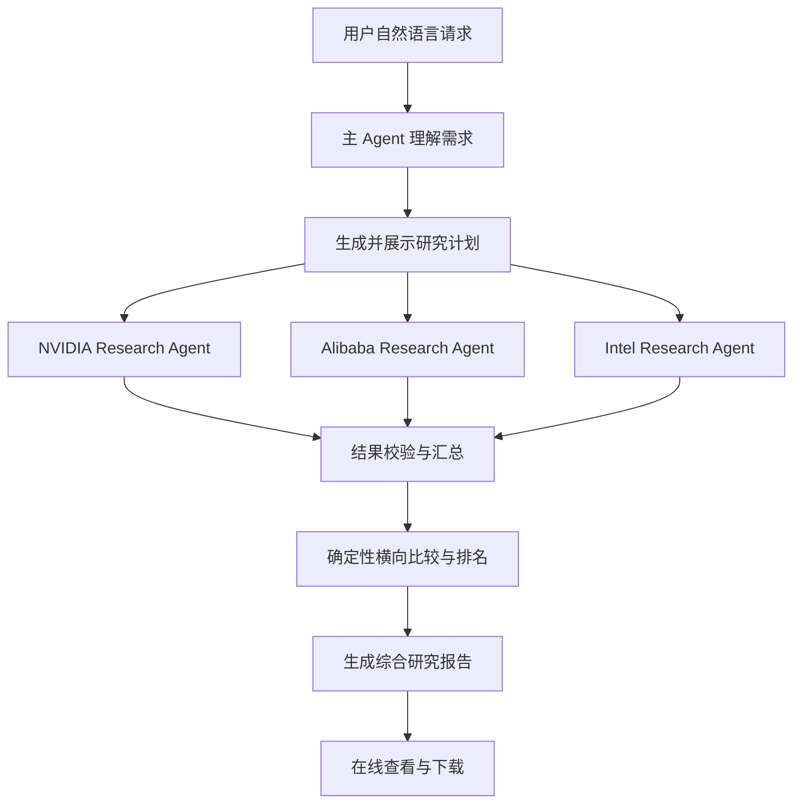

# 股票 Deep Research Agent — 产品需求文档（PRD）

> 产品需求与边界说明
> 版本：对齐版 v4（2026-06-07）
> 产品定位英文名：**U.S.-listed Equity Research Agent**（支持美国上市股票与 ADR，**不限于 NASDAQ**）。
> 本文是后续开发的需求基线，本身也是交付物之一。**只描述功能与产品边界**；技术栈/模型/框架等实现细节另出 spec，不写进本文。

---

## 0. 一句话定义与范围

> 一个面向**非专业用户**的对话式美股研究助手。用户用自然语言说"研究哪几家公司、看哪段时间、关注什么"，Agent 自动识别公司、获取行情、确定性计算市场风险、围绕异动检索事件证据、横向比较，最终产出一份**可下载的英文研究报告**。

本项目是**研究辅助工具**，所有输出必须声明"不构成投资建议"。

### 范围分层

| 层 | 内容 | 定位 |
|---|---|---|
| **A · 核心** | 识别公司 → 定时间 → 取行情 → 代码算市场风险指标 → 归一化对比 → 可下载报告 | 核心需求 |
| **B · 进阶（核心研究能力）** | 找异动 → Tavily 查事件 → Event Attribution Confidence → Short-term Market View | 回答"为什么涨跌不同"的关键研究能力，提供研究深度 |
| **B+ · best-effort 深度** | Business Risks（从 10-K Item 1A / 财报提取经营风险）| 有亮点但较重，做不动就降级为"基于公开新闻的经营风险提示"，不阻塞 A |
| **轻量核心 · 上传文件** | PDF/TXT/MD **文本提取** → 归属公司 → 织进报告并标**文件名+页码**（**不做 OCR / 向量库**）| 非必填，A+B 稳定后接入（见 §16）|
| **明确不做** | 账号/登录/跨会话历史、自动交易、目标价/估值/DCF、A 股/港股/加密、OCR、向量库/复杂 RAG、多 Agent 辩论、单次 >3 只 | 超出当前范围或影响核心链路稳定性 |

> **核心理念（贯穿全文）**：只凭近期股价，系统**只能判断"观察到的市场价格风险"，不能判断整家公司的综合投资风险**。所有结论都分层、规则化、可追溯；模型只解释和提取，不计算行情指标、不编造概率、不断言因果。

---

## 1. 项目背景与目标用户

用户能看到涨跌，但很难快速回答：这家公司最近表现如何？和别人比谁强谁险？某段为什么涨跌？哪些公开信息可能影响走势？怎么整理成一份可读可下载的报告？

面向**不熟悉代码、不会读财报、不想自己算指标**的研究型用户。用户只需用一句话说研究哪些公司、什么时间、关注什么。覆盖**美国上市股票与 ADR**（NASDAQ / NYSE 等）。

### 典型请求
```text
帮我比较英伟达、阿里巴巴和英特尔最近三个月的表现，
分析它们为什么涨跌不同，并重点比较风险。
```

---

## 2. 三条不可动摇的产品原则

1. **数字交给代码，理解交给模型**：所有量化指标由确定性程序计算，模型不参与原始数值计算。
2. **只摆证据与相关性，绝不断言因果**：事件只说"可能相关"，证据不足就说"无法确认"，绝不编造。
3. **来源与时间永远透明**：每个数字/结论/事件都带来源、数据时间、新鲜度；当前价是"部分市场参考价"还是"收盘价"必须分清。

---

## 3. 核心业务流程



> **"多个 Research Agent" = N 个相同的研究 Agent 并发跑同一套固定流程**，不是多智能体辩论。"并发任务"和"多个 agent"在这里是一回事。

### 单只股票 Research Agent 的固定流程
1. 解析任务，锁定证券身份
2. 取行情、代码计算市场风险指标
3. （B+，best-effort）取财报/申报/上传文件
4. （B）围绕异动检索事件与新闻证据
5. 证据质量检查
6. 返回统一结构的结构化结果（供主 Agent 做确定性比较与排名）
7. 模型只对结构化结果做**解释**，不重算

---

## 4. 自然语言理解与任务槽位

```json
{
  "intent": "multi_stock_deep_research",
  "companies": [
    {"user_input": "英伟达", "company_name": "NVIDIA Corporation", "symbol": "NVDA", "exchange": "NASDAQ", "instrument": "common"},
    {"user_input": "阿里巴巴", "company_name": "Alibaba Group Holding Limited", "symbol": "BABA", "exchange": "NYSE", "instrument": "ADR"}
  ],
  "time_range": {"label": "最近三个月", "start_date": "2026-03-07", "end_date": "2026-06-05", "source": "user_explicit"},
  "focus": ["performance", "price_drivers", "risk"]
}
```
模型负责理解语言；业务规则负责补默认值、验证公司、生成明确日期。

### 时间范围规则
| 用户表达 | 系统执行 |
|---|---|
| 最近走势 / 没给范围 | 默认最近 30 个自然日，并说明 |
| 最近一个月 / 三个月 / 半年 | 30 / 90 / 180 个自然日 |
| 今年以来 | 当年 1/1 至最新交易日 |
| 最近几个月 | 默认三个月，并说明 |
| 超过最长范围（1 年）| 告知上限，默认按 1 年，说明更长期超范围 |
| 未来 / 超出可用数据的日期 | 如实说明该区间无数据，给出可用范围，不硬编 |

**时间边界：单次最长 1 年**（约 250 交易日）。理由：产品定位"最近表现"；时间越长异动越多、事件研究会爆；超长日线不可读。
> 拉长时间**不撑爆模型上下文**——日线由代码算，模型只看摘要 + 几个异动 + 证据。真正随时间增长的是事件研究，由 §6 异动上限控制。

---

## 5. 公司识别与标的范围

### 识别规则
- 支持中文名、英文名、股票代码输入。
- 用**支持名单（catalog）**裁决"支不支持"——名单定时从行情源拉取、过滤为美国交易所上市标的（含 ADR）、排除 OTC 粉单、本地缓存。**这是唯一权威，不让模型临时判断**。
- 分工：模型把用户话**归一成候选**（"英伟达"→NVDA 候选）→ 代码拿候选去**名单匹配** → 命中即锁定规范代码/交易所/标的类型。中文名对常见公司另维护**别名表**（英伟达→NVDA、阿里→BABA、英特尔→INTC）。
- **识别后必须展示实际标的**：
  ```text
  Alibaba Group Holding Limited   Ticker: BABA   Exchange: NYSE   Instrument: ADR
  ```
- **BABA（美股 ADR）与 9988.HK（港股）是不同标的**，行情/财报/事件不得混用。

### 边界与失败处理
- **不在名单**（**仅港股/A 股上市、仅 OTC、或其他不属于"美国上市股票及 ADR"的标的**；注意中概 **ADR**（如 BABA）属于**支持范围**）→ 如实回复"没找到 X 的美股标的，本产品只覆盖美国上市股票及 ADR"，不编造代码。
- **歧义**（多匹配）→ 只问一个澄清问题。
- **没给公司 / 跑题 / 非研究输入** → 没公司就问要研究哪家；跑题就礼貌说明本产品只做美股研究。
- **多股请求里部分可识别**（"英伟达+小米+英特尔"）→ **能识别的照常研究，识别不了的明确标注、不静默丢**。
- **超过 3 只**（硬上限）→ 识别全部、告知上限、默认取最先提到的 3 家并标注其余被推迟、允许改选；会话中追加则提示"满 3 家，加 X 需替换一家"。
> 原则：**永不静默截断**——边界对用户始终可见，控制权交还用户。

---

## 6. 市场表现与显著波动（A + B）

所有股票使用**相同起止日期**与统一口径。

### 指标口径（明确定义）
- **复权收盘价**：**默认用拆股复权日收盘价**（Twelve Data 日线默认拆股复权 ✅）；**数据源若同时提供分红复权价则优先用**；数据源无法提供任何复权价时，降级用普通收盘价并在报告中明确标注（避免因无复权数据导致整任务失败）。**未含分红调整时，区间收益称为 Price Return，不称 Total Return。**
- **区间收益率** = 期末收盘 / 期初收盘 − 1。
- **日波动率** = 每日收益率标准差；**报告展示年化波动率**（日波动率 × √252）便于阅读；**绝对等级与风险分数用日波动率**。
- **Negative-day volatility（负收益日波动率）** = 负收益交易日的收益率标准差（**MVP 简化口径，命名上如实区分，不等同标准金融定义的 Downside Deviation**）；与年化波动率口径一致**按 × √252 年化展示**；**负收益日 < 2 天则输出 N/A**。
- **最大回撤** = 区间内最高收盘价到其后最低收盘价的最大跌幅。
- **最大单日涨跌（Largest Daily Move）**、**上涨/下跌交易日数**、**成交量变化（= 最新成交量 / 20 日均量 − 1）**、**Data Coverage**（实际有效日线 / 预期交易日，如 61/63；coverage_ratio = 实际/预期）。
- 货币 USD；日期美东时间（ET）；"最新"= 最近一个已完成美股交易日。
- 当前价必须显示：价格时间、数据源、是否延迟/部分市场。

### 归一化图表
所有股票同一起始日设为 100；某股起始日无数据则用窗口内首个可交易日为基准并注明。

### 显著波动识别（代码，固定两个）
- **最大单日涨跌** → 用来定位"去查哪天的事件"。
- **最大回撤区间** → 用来讲风险。
默认展示**最显著的一次单日波动**，最多扩展到 3 次。
**显著阈值**：最大单日绝对涨跌幅 **< 2% → 视为无显著单日异动**（否则系统总能选出"最大的一天"，哪怕只涨 0.3%）；阈值配置化。
**事件归因默认只对最大单日异动做**；最大回撤区间主要用于风险展示，不强制做事件归因。
**走势平稳无显著波动** → 明说"本期走势平稳、无显著异动"，不硬造、不硬找事件。
> **异动上限**：每股深挖 ≤ 3 个；事件检索每股最多两轮、同事件多源去重、每个异动留 2–3 条最相关。

---

## 7. 事件研究（B · 核心研究能力）

围绕异动日、限定公司、在异动日前后窗口用 **Tavily** 检索：财报/指引、产品/合作/订单、监管/诉讼/政策、管理层、行业供需、宏观/利率、舆情。

### 事件方向分类（固定枚举 · 仅用于展示）
**模型**根据标题、摘要、与公司的关系做结构化分类，输出只能是 `positive / negative / neutral / unclear`，`unclear` 为默认兜底。
**关键边界**：事件方向**只用于报告展示，不参与任何硬结论**——不能改动行情指标、Observed Market Risk 或 Short-term Market View。模型可分类、可解释，但不能用它改判数值结论。

### 可靠事件来源分级（供 Event Attribution Confidence 判定）
- **高可信**：公司公告、SEC 文件、交易所公告。
- **可信**：Reuters、Bloomberg、主流财经媒体。
- **弱相关**：聚合页、自媒体、无法确认来源的内容。
> 维护一份域名可信度名单；同一事件按独立来源**去重**后再判定 confidence。

### 原因表达规则（强制）
- 只说"**可能相关事件**"："该事件发布时间与股价下跌接近，可能是影响因素之一。"
- **绝不**写"This event caused the stock to fall."
- 证据不足："当前公开证据不足以确认这一阶段股价变化的主要原因。"

---

## 8. 研究结论：分层、规则化、可解释（核心）

> 把"风险"拆成三块独立输出，再单独给一个"短期市场观点"。模型只解释/提取，**不算指标、不编造概率**。配置化阈值**不对外宣称是行业标准**；用 NVDA/BABA/INTC 做结果检查（示例样本），**不当作正式校准**（正式校准需更广样本）。

### 8.1 Observed Market Risk（市场价格风险 · 代码计算）

展示指标：Annualized Volatility、Maximum Drawdown、Negative-day Volatility、Largest Daily Move、Data Coverage、Relative Risk Rank。

**(a) 连续风险分数（0–100，用于组内相对排名）**
```
vol_score      = min(日波动率 / 5%, 1) × 100      // 日波动率达 5% 记满
drawdown_score = min(|最大回撤| / 30%, 1) × 100   // 回撤达 30% 记满
risk_score     = vol_score × 60% + drawdown_score × 40%
```
超出上限仍记 100，防极端值扭曲比较。**分数只用于排序、不决定绝对等级。**（权重 60/40：波动率覆盖整个区间、回撤只反映最差一段，故波动率权重稍高。）
> 报告："NVDA showed the highest observed market risk among the selected stocks." + caveat："Relative ranking is limited to the selected stocks and analysis period."（三只里最高 ≠ 全市场最高。）

**(b) 绝对等级（Low / Medium / High / Undetermined · 配置化阈值 · 与组合无关、与时间范围相关）**
最严重优先，命中即停（阈值取**包含边界**）：
1. 有效日线 < 10 根 **或 Data Coverage < 80%** → **Undetermined**（界面解释原因，且不参与相对排名）
2. 日波动率 **≥** `high_volatility`(3%) 或 最大回撤 **≤** −`high_drawdown`(20%) → **High**
3. 日波动率 **≥** `medium_volatility`(1.5%) 或 最大回撤 **≤** −`medium_drawdown`(10%) → **Medium**
4. 其他 → **Low**
> 相对排名：**单股查询不排名**；风险分数相同则**并列**。
> 绝对等级**不受本次对比股票影响，但与选定分析时间范围相关**（同一只票查 30 天 vs 1 年，最大回撤不同，等级可能不同）。报告必须展示 **Observation period**（如 `Observed Market Risk: High / Observation period: 2026-03-01 → 2026-06-01`）。三只都 High 时同时说："All three are High under absolute thresholds; among them NVDA has the highest relative risk score."

```
RISK_THRESHOLDS = { medium_volatility: 0.015, high_volatility: 0.030,
                    medium_drawdown: 0.10, high_drawdown: 0.20 }   // 配置化，可调
```

**(c) 相对排名的可比前提**：仅当相同时间范围 + 相同交易日 + 相同计算方式 + 有效日线均达标时才排名；用户分别查了不同范围则不直接排名。

### 8.2 Business Risks（公司经营风险 · 从资料提取 · B+ best-effort）
**不由股价计算**，按发行人类型从对应申报提取并归类：
- **美国本土发行人** → 10-K **Item 1A** Risk Factors / 10-Q / 8-K
- **外国私人发行人（如 BABA）** → 20-F **Item 3.D** Risk Factors / 6-K
- 外加上传文件、重大新闻/监管事件。

类别：Regulatory / Competitive / Financial / Customer Concentration / Geopolitical / Operational。模型**提取、归类、解释**，**不生成虚假概率**。
> **范围说明**：完整 10-K 抽取较重 → 当前 best-effort（拉最新 10-K 的 Item 1A，模型摘 top 3–5 类 + 标来源）；做不动就降级为"基于公开新闻的经营风险提示"。**不阻塞 A 核心**。
> （可选亮点）每条风险配"证据 + 可观察触发条件"，例：Margin pressure ｜ Gross margin −180bps YoY ｜ next quarter −150bps+。

### 8.3 Event Attribution Confidence（事件解释可信度 · 每个显著波动单独输出）
按 §7 来源分级判定：
- **High**：异动时间附近有**多个高可信/可信来源**，且明确提到该股票/公司。
- **Medium**：有相关事件，但只有单一来源或无法确认因果。
- **Low**：未找到可靠事件，或只有弱相关来源。
> **"没找到新闻" ≠ "整份研究证据不足"**——只是把该异动的 attribution confidence 记为 Low，行情分析照常。

### 8.4 Short-term Market View（短期市场观点 · 取代旧"研究倾向"）
枚举 **Positive / Neutral / Cautious**（行情数据缺失 → Insufficient data）。
**收益阈值随时间范围动态缩放，且用预期交易日数（不因数据缺失而降低，避免"少给数据反而更容易判积极/谨慎"）**：
```
return_threshold = 5% × √(预期交易日数 / 21)
   30天 ≈ ±5.0%   3月 ≈ ±8.7%   半年 ≈ ±12.2%   1年 ≈ ±17.3%
```
规则自上而下，命中即停：
1. 行情数据缺失 / 有效日线 < 10 / **Data Coverage < 80%** → **Insufficient data**（且不参与相对排名）
2. 绝对市场风险 = High → **Cautious**
3. 区间收益 < −return_threshold → **Cautious**
4. 区间收益 > +return_threshold → **Positive**
5. 其他 → **Neutral**
**强制声明**："This view describes recent market conditions and is not a buy or sell recommendation."
> 改名理由：它本质是**短期行情信号**，不是投资建议（没考虑估值、利润、现金流、预期是否已反映）。叫"短期市场观点"更专业，也挡住"为什么 >5% 就积极"的追问。

### 8.5 跨股票比较
基于结构化单股结果做**确定性比较与排名**；模型解释，不重算。**不输出买卖指令或收益承诺。**

### 8.6 硬性要求（封板）
1. 相对风险排名**只在本次所选股票之间**，明确标注。
2. 自定义阈值**不描述为行业标准**。
3. 风险等级用 **Observed Market Risk**；研究倾向用 **Short-term Market View**。
4. 市场价格风险 / 公司经营风险 / 事件解释可信度**分别输出**。
5. 模型负责解释与提取，**不计算行情指标**；**事件方向分类只用于展示，不参与风险 / Market View 等硬结论**。
6. 每个结论显示**指标、证据来源、数据时间、限制**。
7. 显著波动只展示"可能相关事件"，**不声称确定因果**。
8. 报告必须含**数据缺失提示**与**非投资建议声明**。

---

## 9. 数据来源（已验证）

| 能力 | 数据源 | 状态 |
|---|---|---|
| 当前参考价、**拆股复权日线** | Twelve Data Basic | ✅ 实测；日线默认拆股复权 |
| 新闻 / 事件 / 舆情（B）| Tavily | ✅ 实测返回带时间来源结果 |
| 财务事实 / 10-K 申报（B+ / 可选）| SEC EDGAR | ✅ 实测 |

**接入**：Twelve Data 与 Tavily 需免费 API Key（环境变量 `TWELVE_DATA_API_KEY` / `TAVILY_API_KEY`）；SEC EDGAR 免 Key，需合规 `SEC_USER_AGENT`。**实时性**：免费实时是部分市场（约 5% 成交量）→ 当前价当"参考价"标注、不用于交易；走势用已完成日线。免费额度内（三股 × 报价+历史 ≈ 6 次）。

---

## 10. 单股票研究结果（统一结构）

> 示例数值已按 §8 规则**自洽校验**（risk_score 与 absolute_level 由公式反推一致）。

```json
{
  "company": {"name": "NVIDIA Corporation", "symbol": "NVDA", "exchange": "NASDAQ", "instrument": "common"},
  "period": {"start_date": "2026-03-07", "end_date": "2026-06-05",
             "expected_trading_days": 63, "effective_trading_days": 61, "data_coverage_ratio": 0.968},
  "observed_market_risk": {
    "annualized_volatility_percent": 42.3, "daily_volatility_percent": 2.665,
    "max_drawdown_percent": -13.8, "negative_day_volatility_percent": 31.5,
    "largest_daily_move_percent": -7.2,
    "vol_score": 53.3, "drawdown_score": 46.0, "risk_score": 50.4,
    "absolute_level": "medium", "relative_rank": 1,
    "observation_period": "2026-03-07 to 2026-06-05"
  },
  "period_return_percent": -10.4,
  "significant_moves": [
    {
      "move_id": "largest_single_day_2026-05-29", "type": "largest_single_day",
      "date": "2026-05-29", "change_percent": -7.2,
      "events": [{"title": "...", "date": "2026-05-28", "source": "Reuters", "url": "...", "direction": "negative"}],
      "attribution_confidence": "medium",
      "confidence_reason": "One credible source identified near the move; causation not confirmed."
    },
    {"type": "max_drawdown", "from": "2026-05-12", "to": "2026-05-29", "drawdown_percent": -13.8,
     "note": "Used for risk display; event attribution not performed by default."}
  ],
  "business_risks": [{"category": "Regulatory", "summary": "...", "source": "latest 10-K Item 1A"}],
  "short_term_market_view": "cautious",
  "return_threshold_percent": 8.7,
  "market_view_reason": "Period return -10.4% is below the dynamic negative threshold (-8.7%).",
  "sources": [], "warnings": []
}
```

---

## 11. 可视化研究编排

前端让用户看到 Agent 如何研究（不是一次性吐答案）。**研究计划展示后自动执行**（不设人工确认门槛，流程连贯）。

研究计划（阶段 1 并行单股 → 阶段 2 横向比较 → 阶段 3 报告生成）与每股状态实时可见：
```text
NVIDIA
✓ 公司识别（NVDA · NASDAQ · Common）
✓ 行情与市场风险指标
✓ 最大单日波动 + 最大回撤区间
● 正在检索相关事件，已获得 5 条证据
○ 等待生成结论
```
状态：等待 / 执行中 / 已完成 / 部分完成 / 失败。**不展示模型思维链、不展示技术日志**。

---

## 12. 当前会话与追问

> 重点不是"聊天记录"，而是 **Agent 知道哪些数据查过、哪些已确认、哪些已失效、哪些要重查**。第一问出报告，之后基于已分析内容继续答，不是每轮都出整份报告。

### 当前会话连续性
本期支持一个当前研究会话，不要求账号系统、跨会话历史或页面刷新后的恢复。

在当前会话内，用户可以持续进行多轮交流。Agent 应持续保留当前研究股票、时间范围、关注点、已有结构化研究结果、事件证据、上传文件和当前报告。

当对话内容较长时，Agent 仍应保持关键研究上下文一致，**不得因对话轮次增加而混淆或遗忘**当前股票、时间范围、已有结论、用户已确认的选择和当前报告。

### 会话资产
用户上传文件、系统生成报告、行情数据摘要、事件证据和研究结果属于**当前会话资产**。

Agent 不需要在每轮对话中读取完整文件或完整报告，但在用户追问相关内容时，应能够**定位并引用对应资产的相关部分**。

用户应能够：
- 基于已生成报告继续追问；
- 基于上传文件继续追问；
- 查看结论对应的来源、文件名、页码或链接；
- 修改研究范围或关注点后，基于当前最新研究状态重新生成报告。

### 增量研究与结果复用
用户在当前会话中修改研究请求时，系统应**尽可能复用未变化的研究结果**，并只对变化部分重新执行研究：
- **只改变分析角度**（如"重点看风险"）：复用已有结果重新组织回答；
- **替换、增加或删除股票**：只研究新增或变化股票，并更新比较结果；
- **修改时间范围**：重新获取受影响股票的行情与事件（旧指标不得用于新时间范围）；
- **上传补充文件**：分析文件并更新相关公司结论与报告；
- **请求更新报告**：基于当前最新研究状态生成新报告版本。

### 通用股票能力
**固定示例股票仅用于回归测试和说明，不是产品能力边界。**

产品能力应覆盖支持名单中的**任意美国上市股票与 ADR**。用户输入股票代码、英文名或常见中文名时，系统应通过通用支持名单和别名机制识别标的，并使用同一套研究流程执行。

**实现不得依赖固定股票代码、固定公司组合或固定用户表达。**

> 语言：**对话跟随用户（中文）**，**正式报告英文**；§8 结论枚举在报告里用英文标签。

---

## 13. 综合研究报告

### 语言与格式
**英文**正文；应用内 HTML 渲染（含走势图）；下载 **PDF（主）+ Markdown**，图用静态 PNG 嵌入。先做 Markdown 保证有，再加 PDF。

### 每只股票固定 9 节
1. **Company Snapshot**（名称 / Ticker / Exchange / Instrument）
2. **Price Trend**（归一化走势、区间收益、区间高低）
3. **Observed Market Risk**（年化波动、负收益日波动、最大回撤、最大单日、风险分数、绝对等级、相对排名 + caveat、Data Coverage、Observation period）
4. **Significant Price Movement**（最大单日 + 最大回撤区间）
5. **Related Events**（含 direction + Event Attribution Confidence）
6. **Financial & Filing Highlights**（SEC / 上传，best-effort；无则注明）
7. **Business Risks**（分类提取 + 来源标注；"Catalysts" 当前不单独定义）
8. **Short-term Market View**（Positive / Neutral / Cautious + 非建议声明）
9. **Evidence & Limitations**（来源、数据时间、缺失提示）

### 固定免责声明
英文报告用英文声明；中文 UI 可用中文声明。

**English (used in the English report):**
> This report is generated from market data and public information within the specified period, for information aggregation and research reference only. It does not constitute investment advice, a buy/sell recommendation, or any return guarantee. Temporal correlation between events and price changes does not prove causation. Market prices can change rapidly; please make independent decisions based on your own risk tolerance and after consulting a professional.

**中文（UI）：**
> 本报告基于指定时间范围内的市场数据与公开信息生成，仅用于信息整理与研究参考，不构成投资建议、买卖推荐或收益承诺。事件与价格变化的时间相关性不代表已证明因果关系。市场价格可能快速变化，请结合自身风险承受能力并咨询专业人士后独立决策。

---

## 14. 异常与边界处理（完整清单）

| 场景 | 系统行为 |
|---|---|
| 没给公司 / 跑题 / 非研究输入 | 没公司就问要研究哪家；跑题礼貌说明只做美股研究 |
| 无法唯一识别公司（歧义）| 只问一个澄清问题 |
| 公司不在名单（仅港股/A股、仅 OTC、非美国上市标的；**中概 ADR 如 BABA 仍支持**）| 如实告知未找到美股标的，不编造代码 |
| 多股请求部分可识别 | 能识别的照常做，识别不了的明确标注、不静默丢 |
| 请求股票数 > 3 | 识别全部、告知上限、默认前 3、标注其余、允许改选/替换 |
| 未给时间范围 | 默认最近 30 天并告知 |
| 时间超 1 年 | 默认按 1 年、说明更长期超范围 |
| 未来/超出数据范围的日期 | 如实说明无数据、给可用范围 |
| 有效日线 < 10 根 | Observed Market Risk = Undetermined，界面解释 |
| 本期无显著波动 | 标注"走势平稳、无显著异动"，不强行找事件 |
| 某只股票行情失败 | 其他股票继续；该股标记失败、隔离 |
| 当前价格不可用 | 用最近收盘价并标注 |
| Tavily 失败/无结果 | 保留行情分析与 Short-term Market View；该异动 Event Attribution Confidence = Low，不强行解释 |
| 事件方向打平/混合 | 记 unclear |
| 上传文件与公开信息冲突 | 报告明确提示冲突，不用文件覆盖行情 |
| 某个 Research Agent 超时 | 其他任务继续；报告说明缺失部分 |
| 数据来源时间不同 | 分别展示行情截止时间与事件数据时间 |

> **缓存/离线快照**：当前**不作硬性要求**——优先把在线调用调稳；外部服务失败时，如实说明并展示降级，而不是伪装成实时。（如有余力可准备带时间戳快照，但不强制。）

---

## 15. 实现阶段（建议顺序）

- **阶段一 · 单股闭环**：识别→行情→市场风险指标→（B）异动+事件→单股结论。验收：输入"分析英伟达最近三个月，解释明显涨跌原因" → 正确身份/标的类型、市场风险指标、最大单日/最大回撤、带来源事件 + Event Attribution Confidence、Short-term Market View。
- **阶段二 · 多股并行 + 报告（含 B）**：并行研究、可见状态、横向比较与排名、可下载报告、当前会话追问。验收：输入示例问题 → 并行计划与状态 / 多股研究 / 横向比较 / 生成并下载英文报告。
- **阶段三 · 稳定与完善**：验证示例成功场景 / 行情失败 / 新闻不足 / 单任务超时；完善来源时间与免责声明；整理 README。上传文件在主链路稳定后接入；B+ Business Risks 视情况可降级为"基于公开新闻的经营风险提示"。
- 停止规则：单股未通不做多股；核心未稳不做美化/B+/上传。

---

## 16. 上传文件作为补充证据（轻量核心）

> **轻量核心**能力：只做 PDF/TXT/MD **文本提取**，**不做 OCR、不做向量库**。不改核心流程（叠加，不是重构），没上传也能完成完整研究；A+B 主链路稳定后接入。
- 上传文件 = **补充证据**，**不能覆盖真实行情数据**。
- **匹配到公司**：用 §5 识别能力归到当前某一家；归不上就提示、不硬塞。
- **输出灵活**：关键发现织进报告的 Business Risks / Financial Highlights（或给建议），不必单独出文档。
- 报告标注**文件名 + 引用页码**；与公开信息**冲突时明确提示**。
- 支持 PDF / TXT / Markdown；单文件 ≤ 10MB；非必填。

---

## 17. 验收标准

**用户理解**：只输入公司名 / 1–3 家 / 常见时间范围 / 未指定默认 30 天 / 追问继承公司与时间。
**研究编排**：展示研究计划 / 多股并行 / 每股独立可见状态 / 单任务失败不阻塞 / 汇总只用经校验的结构化结果。
**数据与分析**：相同起止日期 / 复权收盘价 / 指标代码确定性计算 / 识别最大单日与最大回撤 / 事件含时间来源链接与 direction / 谨慎措辞不断言因果 / 结论按 §8 规则、分层输出。
**报告**：英文多股报告 / 每股 9 节含标的类型 / 含走势、市场风险、事件、经营风险（best-effort）、Short-term Market View、来源 / 可下载（PDF+MD）/ 始终含免责声明 / 相对排名标注"仅限本次所选股票与区间"。
**可靠性与降级**：示例三股（NVDA/BABA/INTC）能稳定复现 / 外部失败时清晰降级或如实说明 / 备示例问题 + 期望事实样本集。

---

## 18. 开发说明（Development Notes）

本文件是后续开发的需求基线。每个任务含：用户场景、输入与期望输出、涉及阶段、前端需展示状态、可验证验收示例、必须运行的验证。以**可独立验收的业务闭环**为单位，按纵向链路推进。

> 本文件只到**功能与产品边界**层。技术栈、模型/runtime、框架、目录结构等实现细节，待需求封板后另出 **spec** 文档，不写进本 PRD。
