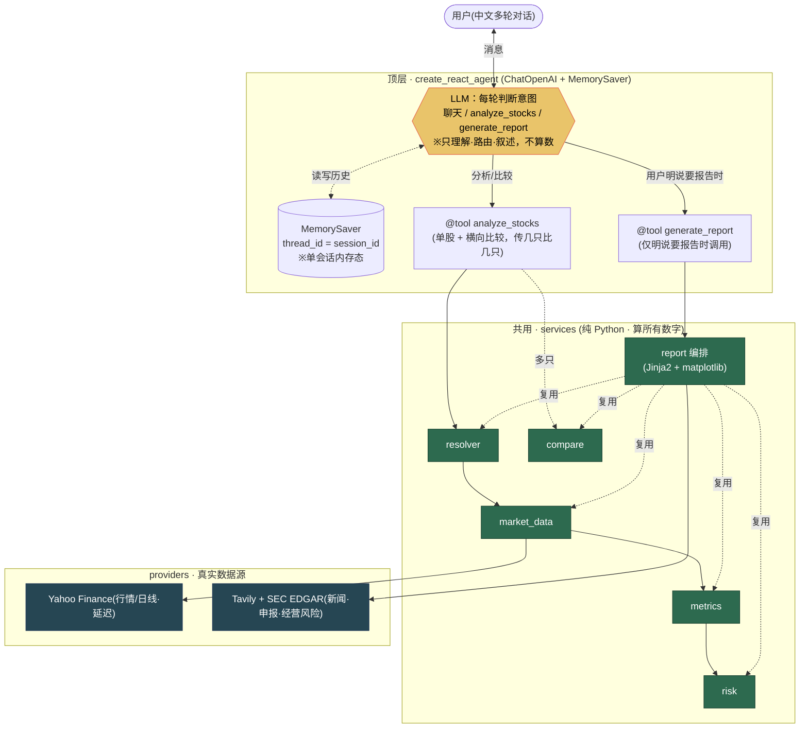

# Plan — phase-1-mvp / 后端（两层对话 Agent · HOW）

> SDD 流程：Constitution → Specify → **Plan（本文）** → Tasks → Implement
> 依据：[`../PRD.md`](../PRD.md)（两层架构定稿版 v6 · 需求基线）、[`spec.md`](spec.md)（US + AC + §2 选型方向 + §5.B 公式）；根本大法 [`../../../constitution.md`](../../../constitution.md)
> 本文是 **HOW**：详细架构 + 接口契约 + 技术栈拼装 + 目录。承接 spec，更具体到「照着能写代码」。

> **两条铁律（贯穿全文）**
> 1. **用框架不造轮子**：对话 agent 循环 = `create_react_agent`（不手写 ReAct 状态机）；会话记忆 = `MemorySaver`（不手写 session）；LLM + 工具 = `ChatOpenAI` + `@tool`（不手写 function-calling）；HTTP = FastAPI；配置/模型/结构化/启动校验 = pydantic + pydantic-settings；行情 = yfinance（Yahoo Finance，免费、无需 key、含 ADR/BABA、延迟/EOD）；数值运算 = numpy/pandas 向量化（不手撸 for 循环）；图 = matplotlib；报告排版 = Jinja2。**只手写「金融口径纯函数 + 薄编排胶水」。**
> 2. **逻辑零偏差**：四条不变量必须在架构里落实 ——（i）`analyze_stocks` 永不出报告；（ii）`generate_report` 仅被明确要求时触发；（iii）对外只有这两个工具，无第三个；（iv）所有数字只在 `services/` 纯函数里算，LLM 不算数。金融公式与 spec §5.B **字字一致**。

---

## 1. 概述与架构总览

承接 PRD v6 的**两层架构**：

- **顶层 · 对话 Agent**：一个 `create_react_agent` 装配的 ReAct 循环（LLM + 会话记忆 + 两个工具）。平时负责闲聊、解释概念、**单股分析**、**横向比较**、引用报告追问——**这些都在对话里直接完成**。意图识别**不另建模块**：它就是 LLM 工具调用自带的能力（看用户这句话，自己决定不调工具 / 调 `analyze_stocks` / 调 `generate_report`）。
- **下层 · 报告生成编排**：`generate_report` 工具体内部的一条**简单顺序流程**（逐只固定分析 → 汇总 → 横向比较 → Jinja2 组装 9 节英文 markdown + matplotlib 渲染走势 PNG）。**仅当用户明确要报告时**才被 LLM 调用，平时根本不运行。`build_report`（编排内部函数）在执行过程中通过 **contextvar 进度 sink** 向外发射实时逐阶段进度事件（每个阶段 start/done），供流式端点转发给前端——**这不改变确定性固定流程，也不改变两层架构的任何不变量**。
- **共用 · services 内核**：指标 / 风险 / 比较 / 报告编排所依赖的**确定性纯函数**。被上下两层共同复用；**唯一算数字的地方**，不依赖 LangGraph/LLM，可脱离 agent 单测。

数据流红线一句话：**LLM 只理解 / 路由 / 叙述 → 工具是薄封装 → services 唯一算数字（numpy/pandas）→ providers 取真实数据**。



**读图要点**：黄色 LLM 只判意图、路由、叙述；绿色 services 是**唯一算数字**的地方，被两个工具共用；从 LLM 到 `generate_report` 那条线标注「用户明说要报告时」——平时不走。

---

## 2. 技术栈与依赖清单

**运行环境 = Python 3.11（venv；本机默认 `python3` 是 3.9，不用）。** 承接 spec §2，落到实际依赖（每个一句「干什么」）：

| 依赖 | 干什么 |
|---|---|
| `fastapi` | HTTP 服务：`/chat` 对话端点 + `/health` + 报告下载；不手写路由/请求体校验。 |
| `uvicorn` | ASGI 运行 FastAPI 进程。 |
| `langgraph` | 提供 `create_react_agent`（现成 ReAct 循环）+ `MemorySaver`（会话记忆 checkpointer）；**不手写 agent 状态机 / session**。 |
| `langchain-openai` | `ChatOpenAI`：接 OpenAI 做理解 / 路由 / 叙述。 |
| `langchain-core` | `@tool` 装饰器定义两个工具、message 类型；工具 JSON schema 由它生成，**不手写 function-calling**。 |
| `pydantic` | 工具输入 / 返回的结构化模型（`models.py`）：schema 校验、`AnalyzeResult` / `ReportResult` 等。 |
| `pydantic-settings` | `Settings` 加载配置 + 环境变量解析；启动 `require_keys()` fail-fast。 |
| `pandas` | 日线序列承载（DataFrame）、向量化日收益 / 滚动；**不手撸 for 循环做数组算术**。 |
| `numpy` | 标准差（`ddof=1`）、√252、最大回撤扫描、归一化等向量化运算。 |
| `matplotlib` | 把归一化走势序列渲染为 PNG，嵌入报告 Price Trend 节。 |
| `jinja2` | 报告排版：9 节英文 markdown 模板，**不手写大段字符串拼接**。 |
| `yfinance` | Yahoo Finance 免费日线（含 ADR/BABA）+ 延迟参考价；**唯一行情来源**、**无需 key**。 |
| `httpx` | 仅在 SDK 缺能力时的回退 HTTP 客户端（异步）；亦用于 GitHub Contents API 上传走势图 PNG（`services/image_host.py`）。 |
| `rapidfuzz` | resolver 英文公司名模糊匹配（**仅匹配工具**；名单/别名才是支持边界，rapidfuzz 不做"支不支持"裁决）。 |
| `pytest` / `pytest-asyncio` | 单测（services 纯函数 + 工具集成 + agent 冒烟 + fail-fast）。 |
| **`tavily-python`（SDK，REQUIRED）** | 报告 ⑤ Related Events 检索（新闻事件证据）；`TAVILY_API_KEY` 缺失时该节运行时诚实降级，不阻塞启动或核心分析。 |
| **`httpx` + `SEC_USER_AGENT`（REQUIRED）** | 报告 ⑥⑦ Financial & Filing Highlights / Business Risks：动态 CIK 解析 + submissions + companyfacts + 10-K Item 1A 抽取；`SEC_USER_AGENT` 缺失时该节运行时诚实降级，不阻塞启动。 |
| **`pymupdf`（PDF 文本提取）** | `services/document.py` 中 PDF 文本提取；TXT/MD 直读；扫描件/无可提取文本 → raise 诚实错误（不做 OCR）。**不引入新必需 key。** |
| **OpenAI embeddings（复用 `langchain-openai`）** | `services/document.py` 中调用 `OpenAIEmbeddings(model="text-embedding-3-small")`；复用现有 `OPENAI_API_KEY`；**embeddings 可注入 fake（测试离线确定性）**；不可用时退化为关键词检索（诚实降级）。**不引入向量数据库依赖。** |

> 红线（spec §2）：agent 循环 / session / HTTP / 数学循环 = 用成熟库；金融口径规则 + 薄编排胶水 = 自己写。

---

## 3. 目录结构（简单、扁平）

只建必要的东西，不造一堆空包：

```
backend/
  app.py            # FastAPI 实例 + startup 调 require_keys() fail-fast + 装 agent；/chat、/health、报告下载
  config.py         # pydantic-settings Settings + 全部常量（MAX_STOCKS 等）+ 风险阈值 + require_keys()
  agent.py          # 装配 create_react_agent(model, tools=[analyze_stocks, generate_report], checkpointer=MemorySaver())
  tools.py          # 两个 @tool：analyze_stocks / generate_report（薄封装：调 services、组 pydantic 返回）
  prompts.py        # system prompt（人设 + 诚实四原则 + 何时调哪个工具 + 绝不自己算数）
  models.py         # pydantic 结构化模型：CompanyIdentity / Metrics / Risk / AnalyzeResult / ReportResult / 章节索引
  services/
    market_data.py  # Yahoo Finance(yfinance)：get_bars / get_quote（失败 raise 不伪造；延迟报价标注）
    resolver.py     # resolve(text) -> CompanyIdentity | None（全集名单 + 别名表裁决；未命中 None 不编码）
    metrics.py      # 纯函数：区间收益/波动/回撤/最大单日/coverage/归一化（numpy/pandas；spec §5.B）
    risk.py         # 纯函数：risk_score / absolute_level / short_term_market_view（spec §5.B 阈值）
    compare.py      # 纯函数：相对排名（并列 / 单只不排名 / Undetermined 排除 / 带 caveat）
    report.py       # 报告编排：复用上面 services → Jinja2 9 节 + matplotlib PNG + 逐字免责声明
    news.py         # Tavily 客户端 + 事件证据组装（⑤ Related Events）；key 缺失时返回诚实降级结构
    sec.py          # SEC EDGAR 客户端：动态 CIK 解析 + submissions + companyfacts + 10-K Item 1A 抽取（⑥⑦）；不可用时返回诚实降级结构
    image_host.py   # GitHub Contents API 上传走势图 PNG → raw.githubusercontent.com URL；GITHUB_TOKEN/REPO/BRANCH 缺失或上传失败时返回 None（调用方退回后端托管路径），不抛错、不阻塞报告生成（AC-F6）
    document.py     # 新增（增量）：extract_text / chunk_text / embed_chunks / retrieve / summarize；PyMuPDF 提取 PDF 文本，TXT/MD 直读；扫描件→raise；embeddings 可注入 fake（离线测试）
    doc_store.py    # 新增（增量）：session_id → UploadedDoc{filename,text,chunks,embeddings,meta} 内存库；一份/会话，再传替换；与报告库平行、互不影响
  data/
    symbols.*       # 全美股上市全集名单（离线源构建的本地缓存：ticker/交易所/公司名/CIK）
    aliases.*       # 中文别名表（便利通道，非支持边界）
  tests/            # services 单测 + 工具集成 + agent 冒烟 + fail-fast 启动测
```

> 不建：`graph/`（一张 ReAct 图够用，不手搭 StateGraph 子图集）、`stores/`（MemorySaver 持状态，不另建 store）、独立 `orchestrator/`（报告编排就在 `services/report.py`）。报告模板可放 `report.py` 内联模板字符串或 `data/` 旁的 `.md.j2`，二者皆可，不强制独立目录。

---

## 4. 顶层对话 Agent 装配

**核心装配（`agent.py`）**——一行现成 API，不手写循环：

```python
from langgraph.prebuilt import create_react_agent
from langgraph.checkpoint.memory import MemorySaver
from langchain_openai import ChatOpenAI
from tools import analyze_stocks, generate_report, analyze_document
from prompts import SYSTEM_PROMPT

def build_agent():
    model = ChatOpenAI(model=settings.openai_model, temperature=0)
    return create_react_agent(
        model=model,
        tools=[analyze_stocks, generate_report, analyze_document],   # 三个工具；前两个行为不变
        checkpointer=MemorySaver(),                 # 会话记忆，内存态
        prompt=SYSTEM_PROMPT,
    )
```

**意图识别 = LLM 工具调用自带，不另建意图模块**。每一轮 LLM 看用户这句话 + 会话历史，临场决定：不调工具（闲聊 / 解释概念 / 拒答 / 澄清）、调 `analyze_stocks`（分析 / 比较）、或调 `generate_report`（明说要报告）。这正是 spec §4.1「不单独建一套意图工程」。

**system prompt 要点（`prompts.py`，全部用自然语言写进 prompt）**：
1. **人设**：美股研究助手；用户用中文聊天，正式报告产物用英文。
2. **诚实四原则（PRD §3）**：① 数字交给代码、模型只解释（**绝不自己做任何算术或置信度打分**，一律走工具）；② 只摆证据与相关性、绝不断言因果；③ 来源 / 数据时间 / 新鲜度透明，当前价标「延迟参考价、不用于交易」；④ 不构成投资建议（不给买卖 / 目标价 / 估值 / 仓位）。
3. **何时调哪个工具**：要看某只表现 / 风险，或把几只放一起比 → 调 `analyze_stocks`（传 1 只是单股、传 2–3 只附比较），**讲解时不出报告**；用户**明说**「出一份报告 / 生成 report」→ 才调 `generate_report`；引用「报告里阿里第二条风险」→ 从会话里已存的结构化报告精确读取作答；**会话已有上传文档且用户问及该文档** → 调 `analyze_document`（先简述文件，再回答，严格基于文档原文，缺失说「文档中未提及」，不编造）；用户问股票行情而非文档内容时，即使有上传文档也走 `analyze_stocks`（不串）；未上传文档却问「这个文件」→ 提示先上传；闲聊 / 概念 / 跑题 / 非美股 / 歧义 → 不调工具，直接对话（歧义只问一个澄清问题）。
4. **对话为核心、报告按需**：不是每轮调工具，也不是每轮出报告。

**绑定会话记忆**：`thread_id = session_id`。`MemorySaver` 以 `thread_id` 区分会话、持有对话历史与已分析结果；同一 `session_id` 的后续消息复用同一记忆，自然消解「它 / 这三只 / 报告里那条」。

**FastAPI `/chat` 如何 invoke**（`app.py`）：

```python
result = agent.invoke(
    {"messages": [{"role": "user", "content": req.message}]},
    config={"configurable": {"thread_id": req.session_id}},
)
reply = result["messages"][-1].content
```

报告产物（若本轮触发了 `generate_report`）从工具返回 / 会话状态取出，随响应一并给出（见 §9）。

---

## 5. 三个工具的契约（精确）

三个工具都是 `@tool` **薄封装**：归一化入参 → 调 services → 组 pydantic 返回。**工具体本身不含任何数值公式**。

> **增量说明**：`analyze_stocks` 与 `generate_report` 契约**逐字不变**；`analyze_document` 是纯新增第三工具。`agent.py` 中装配改为 `tools=[analyze_stocks, generate_report, analyze_document]`，`parallel_tool_calls=False` 保留。现有两条链路（股票分析 / 报告编排）行为**零改动**。

### 5.1 `analyze_stocks`（单股分析 + 横向比较 · 顶层对话用 · 永不出报告）

```python
@tool
def analyze_stocks(companies: list[str], period: str) -> AnalyzeResult:
    """识别 1–3 只美股 → 取行情 → 代码算指标与市场风险；传 2–3 只附相对排名。不产出报告。"""
```

- **输入**：`companies`（**1–3 只**，中 / 英 / 代码均可）；`period`（自然语言时间范围，工具内解析为明确起止；硬上限 1 年 = `MAX_RANGE_DAYS`）。
- **内部调用链**（逐只）：`resolver.resolve` → `market_data.get_bars` / `get_quote` → `metrics.compute_metrics` → `risk.{risk_score, absolute_level, short_term_market_view}`；**多只**再 `compare.rank`。
- **返回 `AnalyzeResult`**（pydantic）：
  ```
  AnalyzeResult:
    stocks: list[StockAnalysis]
    ranking: RankingResult | None        # 仅 ≥2 只可排名时给；单只为 None（AC-C3）
    warnings: list[str]                  # 部分识别失败 / 超上限 / 默认时间 等可见提示
  StockAnalysis:
    identity: CompanyIdentity | None     # 未命中 = None + reason（不编码，AC-H6）
    metrics: Metrics | None              # §6 全部指标
    risk: Risk | None                    # risk_score / absolute_level / short_term_market_view + caveat
    status: "ok" | "unrecognized" | "data_failed"   # 单只隔离（AC-F2）
  ```
- **不变量**：① **绝不产出报告**（无 markdown / 无下载字段）；② **绝不让 LLM 算数**——所有 metrics/risk 字段由 services 填；③ 单只失败隔离、其余照常、warnings 说明哪只失败；④ 超上限 / 未给时间走 §10 边界并写 warnings（不静默）。

### 5.2 `generate_report`（按需启动报告生成编排 · 下层）

```python
@tool
def generate_report(companies: list[str], period: str) -> ReportResult:
    """仅当用户明确要报告时调用：逐只固定分析→汇总→比较→组装每只 9 节英文 markdown。"""
```

- **输入**：已分析的 **1–2 只**（或对比）；`period`。
- **内部**：触发 §7 报告编排（复用 §6 全部 services），用 Jinja2 组装 + matplotlib 渲染 + 逐字英文免责声明。
- **返回 `ReportResult`**（pydantic）：
  ```
  ReportResult:
    reports: list[PerStockReport]        # 每只一份独立报告文档（N 只 → N 项）
    section_index: list[ReportSectionItem]   # 全批次结构化章节索引，供引用追问（§8）
  PerStockReport:
    report_id: str        # 唯一标识（e.g. UUID 或 "{session_id}-{symbol}"）
    symbol: str           # e.g. "BABA"
    title: str            # e.g. "BABA Research Report — 2026-06-09"
    markdown: str         # 该只的英文全文（9 节 + 免责声明）
    download_ref: str     # 该只报告下载引用（GET /report/{session_id}/{report_id}）
  ReportSectionItem:
    owner_company: str    # e.g. "BABA"
    section: str          # e.g. "Business Risks"
    item: int             # e.g. 2
    text: str             # 该条要点（供 agent 精确复述）
    source: str | None    # 来源 / 链接 / 页码（有则带）
  ```
- **不变量**：**仅被明确要求时调用**（不是流水线终点；用户不要报告这条编排根本不运行 = AC-D3）；报告里所有数值复用 services 已算好的确定性结果，**LLM 只做英文叙述组织，不重算**。

### 5.3 `analyze_document`（文档问答 · 第三工具 · 纯增量）

```python
@tool
def analyze_document(question: str) -> DocumentResult:
    """仅当会话已有上传文档且用户问及该文档时调用：检索相关段落 → 生成基于原文的概述与回答。"""
```

- **触发**：会话已有已上传文档，且用户问题涉及该文档内容。**无上传文档时返回 `{status:"no_document"}`，由 agent 据此提示用户先上传**。**股票行情问题仍走 `analyze_stocks`，互不干扰。**
- **输入**：`question`（用户问题字符串）。
- **内部步骤**（每步 emit 一对 start/done，`symbol="__doc__"`）：
  1. `doc_load`（读取文件）：从 `doc_store` 取本会话文档。
  2. `doc_parse`（解析内容）：确认文本块可用。
  3. `doc_locate`（定位相关内容）：`document.retrieve(question, doc)` → top-k excerpts（余弦或关键词退化）。
  4. `doc_summarize`（理解并汇总）：`document.summarize(doc, excerpts)` → 文件概述 + 相关段落。
- **返回 `DocumentResult`**（pydantic）：
  ```
  DocumentResult:
    status: "ok" | "no_document" | "no_text"
    summary: str | None          # 文件整体概述（先总结）
    excerpts: list[Excerpt]      # 相关段落列表
  Excerpt:
    text: str                    # 原文段落
    locator: str | None          # 定位信息（如页码/段落编号）
  ```
- **不变量**：① 工具只做文本检索 + 定性概述，**不计算价格指标**；② 回答严格基于 excerpts 原文，缺失说「文档中未提及」，**绝不编造**；③ `analyze_stocks` 与 `generate_report` 的行为和链路**逐字节不变**（AC-I4）。

---

## 6. services 层（纯函数契约 · 数字只在这里算）

> 这些是纯函数，**不依赖 LangGraph/LLM，可脱离 agent 单测**（spec §5.B 自洽样例反推）。内部统一 `decimal` 精度，展示转 float/percent；底层向量化用 numpy/pandas。

### 6.1 `market_data.py`（providers 薄封装）
```python
def get_bars(symbol: str, start: date, end: date) -> list[Bar]      # 复权日线（yfinance / Yahoo Finance, auto_adjust）
def get_quote(symbol: str) -> Quote                                  # 当前参考价
```
- yfinance（Yahoo Finance，免费、无需 key，含 ADR/BABA）；**失败 raise，不伪造**（AC-F2 上游）。
- `Quote` 标 `partial_market = True`（「延迟参考价、不用于交易」，AC-F3）；走势用已完成日线。
- `Bar{date, open, high, low, close, adjusted_close, volume}`；缺含息复权数据 → `calculation_basis = split-adjusted`，区间收益标 **Price Return**（不称 Total Return）。

### 6.2 `resolver.py`
```python
def resolve(text: str) -> CompanyIdentity | None
```
- 裁决依据 = **全集名单**（`data/symbols.*`，全美上市宇宙，离线源本地缓存）；**别名表**（`data/aliases.*`）仅中文便利通道，**不是支持边界**。
- 三通道：精确 ticker / 英文名模糊 / 中文经别名表 → 都落到同一份完整名单。
- 命中 → `CompanyIdentity{name, symbol, exchange, instrument(common|ADR), market}`（含 CIK，由 `company_tickers.json` 动态解析，供报告 ⑥⑦ 节 SEC 调用；**绝不硬编码 CIK**，AC-F4）。**ADR 正确**：「阿里巴巴」→ `BABA · NYSE · ADR`，绝不混 9988.HK（AC-H5）。
- **未命中 → 返回 `None`**（+ 调用方据此如实说「未找到对应美股上市标的」，**绝不编码**，AC-H6）。

### 6.3 `metrics.py`（公式严格按 spec §5.B；numpy/pandas）
```python
def compute_metrics(bars, expected_trading_days, ...) -> Metrics
def flag_significant_move(signed_change: float) -> bool      # |change| >= 2% (inclusive)
def normalized_series(closes) -> list[float]                 # base=100
```
公式（**与 spec §5.B 字字一致**）：
```
daily_return[t]      = adjusted_close[t] / adjusted_close[t-1] − 1
daily_volatility     = sample_stdev(daily_returns, ddof=1)
annualized_vol       = daily_volatility × sqrt(252)
negative_day_vol     = sample_stdev(负收益日, ddof=1) × sqrt(252)；负收益日 < 2 → null + reason（非字符串 "N/A"）
max_drawdown         = 区间最高 adjusted_close → 其后最低的最大跌幅（signed，≤0）
max_single_day       = |日收益| 最大者，保留 signed；|幅度| < 2% → significant=false（无显著异动）
data_coverage        = 有效日线 / 预期交易日（市场日历）
normalized_series[t] = close[t] / base_close × 100；首日无数据 → 窗口内首个可交易日 close 为基准并注明
```
- 内部 `decimal`，可单测；每指标带 `calculation_basis`。

### 6.4 `risk.py`（阈值与规则严格按 spec §5.B；纯函数）
```python
def risk_score(m: Metrics) -> dict        # vol_score / drawdown_score / risk_score（仅组内相对排序）
def absolute_level(m: Metrics) -> Level    # Low | Medium | High | Undetermined
def short_term_market_view(m, period_return) -> View   # Positive | Neutral | Cautious | Insufficient data
```
规则（**与 spec §5.B 字字一致**）：
```
vol_score      = min(daily_volatility / 0.05, 1) × 100
drawdown_score = min(|max_drawdown| / 0.30, 1) × 100
risk_score     = vol_score × 0.6 + drawdown_score × 0.4         # 仅用于组内相对排序
absolute_level(最严重优先,含边界):
    有效日线 < 10 或 coverage < 0.8                  → Undetermined
    daily_volatility ≥ 0.03  或 max_drawdown ≤ −0.20 → High
    daily_volatility ≥ 0.015 或 max_drawdown ≤ −0.10 → Medium
    否则                                              → Low
return_threshold = 0.05 × sqrt(预期交易日 / 21)
short_term_market_view:
    缺数 / 有效日线 < 10 / coverage < 0.8 → Insufficient data
    absolute_level = High                → Cautious
    区间收益 < −return_threshold          → Cautious
    区间收益 > +return_threshold          → Positive
    否则                                  → Neutral
```
> 自洽样例（spec §5.B / AC-B4，全项目共用）：`daily_volatility=0.02665, max_drawdown=−0.138, 区间收益=−0.104, 预期交易日=63` → `vol_score=53.3`、`drawdown_score=46.0`、`risk_score≈50.4`（50.38）、`absolute_level=Medium`、`return_threshold=0.0866`、`short_term_market_view=Cautious`、年化波动 ≈ 42.3%。

### 6.5 `compare.py`（横向比较 · 相对排名）
```python
def rank(stocks: list[StockAnalysis]) -> RankingResult | None
```
- 按 `risk_score` **降序**排相对名次（`risk_score` 越高风险越高 → 名次 1；与 tasks T1.3「值越高名次靠前」、PRD 脚本 c「谁风险更高」一致）；`risk_score` 相等 → **并列同名次**（AC-C2）。
- **只 1 只 → 返回 None**（单股无比较语义，AC-C3）；**Undetermined 的不进排名**，caveat 说明被排除（AC-C4 / AC-B6）。
- 结论**必须带「仅限本次所选股票与区间」caveat**（AC-C5），不宣称代表全市场或更长周期。

### 6.6 `report.py`（报告编排）
见 §7（同样纯代码 + Jinja2/matplotlib，复用 6.1–6.5）。

---

## 7. 报告生成编排（`generate_report` 内部）

**简单顺序流程（普通函数即可，无并行 fan-out）**——规模不需要任何并发复杂度：

> **进度事件**：`build_report`（编排内部函数）在每个阶段入口和出口通过 **contextvar 进度 sink** 发射 `{"type":"stage","symbol":<ticker>,"stage":<id>,"status":"start"|"done"}` 事件。`POST /chat/stream` 端点在 invoke 过程中消费这些事件并实时以 NDJSON 行写入响应；同步的 `POST /chat` 端点完全不变（不消费进度事件）。**进度事件是只读侧信道，不影响确定性流程、不影响任何 services 计算、不改变两层不变量。**

```
generate_report(companies(1–N), period)
  └ 逐只走固定分析（复用 services）:
        [emit stage start: identify] resolver.resolve [emit stage done: identify]
        [emit stage start: market_data] market_data.get_bars/get_quote [emit stage done: market_data]
        [emit stage start: metrics] metrics.compute_metrics [emit stage done: metrics]
        [emit stage start: risk] risk.{score, level, view} [emit stage done: risk]
        → metrics.flag_significant_move（找显著波动：最大单日 + 最大回撤区间）
  └ 汇总各只结果
  └ [emit stage start/done: compare] compare.rank（横向比较 · 相对排名 · 带 caveat；排名结果供各只 §3 节引用；symbol="__batch__"）
  └ 逐只独立组装一份 9 节英文 markdown 报告：
        [emit stage start: chart] matplotlib 渲染 [emit stage done: chart]
        [emit stage start: events] news.fetch_events [emit stage done: events]
        [emit stage start: filings] sec.fetch_filings/financials [emit stage done: filings]
        [emit stage start: risk_factors] sec.fetch_risk_factors [emit stage done: risk_factors]
        [emit stage start: assemble] Jinja2 组装 9 节 [emit stage done: assemble]
        ① Company Snapshot ② Price Trend（归一化 base=100 + Price Return + 区间高低）
        ③ Observed Market Risk（年化波动 / 负收益日波动 / 最大回撤 / 最大单日 / risk_score
           / absolute_level / 该批次相对排名+caveat / Data Coverage / Observation period）
        ④ Significant Move
        ⑤ Related Events(REQUIRED；含 direction + Attribution Confidence + title/url/source/date；Tavily 不可用则诚实注明，不阻塞其余节)
        ⑥ Financial & Filing Highlights(REQUIRED；SEC submissions + companyfacts + source link；CIK 动态解析；SEC 不可用则诚实注明)
        ⑦ Business Risks(REQUIRED；10-K/20-F Item 1A 逐字标题 + source_url；无法提取则诚实注明)
        ⑧ Short-term Market View(+非建议声明) ⑨ Evidence & Limitations(来源/数据时间/缺失/图床说明)
  └ matplotlib 渲染归一化走势 → PNG
        → image_host.upload(png) → raw.githubusercontent.com URL（成功时）
        → 上传失败或配置缺失 → 退回后端托管 /reports/{file}.png 路径（AC-F6）
        → URL 嵌入该只报告 Price Trend 节
  └ 追加逐字英文免责声明（PRD §9 / spec §5.D AC-D2，不得意译/缩写）
  └ 返回 ReportResult{reports: list[PerStockReport], section_index}
        每个 PerStockReport = {report_id, symbol, title, markdown, download_ref}
```

逐字免责声明（字符串比对基准，AC-D2）：
> This report is generated from market data and public information within the specified period, for information aggregation and research reference only. It does not constitute investment advice, a buy/sell recommendation, or any return guarantee. Temporal correlation between events and price changes does not prove causation. Market prices can change rapidly; please make independent decisions based on your own risk tolerance and after consulting a professional.

> 可选（不强制、不引入并发）：若要展示编排，可把上面顺序步骤写成一个**极简 LangGraph 顺序子图**；但 1–2 只用普通函数顺序流程已足够，**默认不引入额外复杂度**。
> 产物（结构化报告）存入会话记忆，供后续引用（§8）。

### 7b. 文档分析管道（`analyze_document` 工具内部 · 纯增量）

> **零回归**：此管道完全独立于报告编排，不改动 `services/report.py` 或任何现有 service。

```
analyze_document(question)
  └ 从 doc_store 取本会话文档（无 → 返回 {status:"no_document"}）
  └ [emit doc_load start/done]  确认文档可用
  └ [emit doc_parse start/done] 确认文本块列表非空
  └ [emit doc_locate start/done] document.retrieve(question, doc, k=DOC_TOP_K)
        → 余弦取 top-k（OpenAI embeddings + numpy）
        → embeddings 不可用时退化为关键词检索（诚实降级，不伪造）
  └ [emit doc_summarize start/done] document.summarize(doc, excerpts, llm)
        → 用 ChatOpenAI 生成基于原文的文件概述（llm 可注入 fake）
  └ 返回 DocumentResult{status:"ok", summary, excerpts:[{text, locator}]}
```

四个阶段 id（`doc_load` / `doc_parse` / `doc_locate` / `doc_summarize`）通过现有 `emit_stage` 机制发射，`symbol="__doc__"`，复用 `/chat/stream` NDJSON 协议——**不另造一套流式通道**。数字红线：工具只做文本检索 + 定性概述，**不计算股价指标**；股票行情问题仍走 `analyze_stocks`（AC-I4）。

---

## 8. 会话记忆与报告引用

**记忆载体 = `MemorySaver`**（`thread_id = session_id`）：持有对话历史 + 工具调用产生的已分析结果与报告。**不手写 session / 不手写历史拼接**。

**报告生成后**，把**结构化报告**（即 `ReportResult.section_index`，按 `owner_company / section / item` 组织）随会话状态保留（作为最近一份报告产物 + 进对话消息流）。报告本身小，无需重型 citation 系统。

**引用追问**（脚本 e / AC-E1）：用户问「报告里阿里第二条风险」→ LLM 把它理解为对结构化报告的引用 → **从 `section_index` 精确读取** `owner_company=BABA, section=Business Risks, item=2` 那一条作答（复述要点 + 来源）；**绝不拿成英伟达的、绝不编造**（走结构化索引精确定位，不靠摘要猜）。

**对话变长**（PRD §10）：仅对**早期闲聊消息**做轻量保持（`MemorySaver` + message 历史足以支撑；如需可加一个极简 summary 步骤），但**结构化结果与报告索引始终完整保留**——引用永远走结构化索引。**这是「轻量保持关键上下文」，不是一套重型压缩协议。**

---

## 9. API 契约

语义简单——一个对话端点 + 健康检查 + 报告下载。**不做 202 / 409 那套异步并发语义。**

| 方法 / 路径 | 请求 | 响应 |
|---|---|---|
| `POST /chat` | `{session_id: str, message: str}` | `{reply: str, reports?: [{report_id, title, symbol, download_ref}]}` |
| `POST /chat/stream` | `{session_id: str, message: str}`（同 `/chat`） | `application/x-ndjson`，每行一个 JSON 事件（见下） |
| `GET /health` | — | `{ok: true}`（不依赖 key / agent） |
| `GET /report/{session_id}` | — | 该会话所有报告的列表 `{reports: [{report_id, title, symbol}]}`（按生成时间排序） |
| `GET /report/{session_id}/{report_id}` | — | 指定报告的 markdown 全文（`text/markdown`，可下载） |
| `GET /report/{session_id}/latest` | — | 该会话**最近一次**报告请求中最后一只的 markdown（`text/markdown`，向后兼容保留） |
| **`POST /upload`**（新增） | `multipart/form-data`：`file`（PDF/TXT/MD）+ 表单字段 `session_id` | `200 {filename, pages, chars, status:"ready"}`；错误：`415`（不支持类型）/ `413`（过大）/ `422`（无可提取文本 / 扫描件，**不支持 OCR**）|

- `/chat`：同步 invoke agent（§4）；`reply` = LLM 最终自然语言回答（中文跟随用户）；本轮若触发 `generate_report` 则响应附 `reports` 数组（每项含 `report_id` / `title` / `symbol` / `download_ref`，供前端渲染报告列表与下载链接）；非报告轮次 `reports` 字段省略。**此端点保持同步，向后兼容不变。**
- `POST /chat/stream`：请求体与 `/chat` 完全相同（`{session_id, message}`）。响应 Content-Type 为 `application/x-ndjson`，每行一个 JSON 对象：
  - **阶段进度事件**（仅在本轮触发 `generate_report` 时产生）：`{"type":"stage","symbol":<ticker|"__batch__">,"stage":<stage_id>,"status":"start"|"done"}`
  - **完成事件**（每轮必有，作为流的最后一行）：`{"type":"done","reply":<str>,"reports":[{report_id,title,symbol,download_ref}]|null}`
  - 非报告轮次：无阶段进度事件，仅一行 `done` 事件（`reports: null`）。
  - **十个股票报告阶段 ID（规范顺序）**：`identify` → `market_data` → `metrics` → `risk` → `compare`（`symbol="__batch__"`）→ `chart` → `events` → `filings` → `risk_factors` → `assemble`。每个逐只阶段（`identify` 至 `risk`，以及 `chart`/`events`/`filings`/`risk_factors`/`assemble`）的 `symbol` 为具体 ticker；`compare` 阶段 `symbol` 为 `"__batch__"`。
- **四个文档阶段 ID（`analyze_document` 触发时，`symbol="__doc__"`）**：`doc_load`（读取文件）→ `doc_parse`（解析内容）→ `doc_locate`（定位相关内容）→ `doc_summarize`（理解并汇总）。文档轮次的 `done` 事件 `reports` 字段为 `null`。**股票报告轮次与文档轮次互不干扰；非报告、非文档轮次（闲聊/分析）仍只有一行 `done` 事件，无任何阶段事件。**
- `GET /report/{session_id}` → 会话报告列表（含所有已生成报告，跨多次请求累积）。
- `GET /report/{session_id}/{report_id}` → 单只报告 markdown，供按只下载。
- `GET /report/{session_id}/latest` → 保留向后兼容，返回最近一次报告请求的最后一只 markdown。
- 边界 / 降级体现在 `reply` 文本（对话式可见，永不静默截断），**不是 HTTP 错误码**。

---

## 10. 配置与 fail-fast

**`config.py` = pydantic-settings `Settings` + 全部常量**：

- **`Settings`（pydantic-settings）**：从环境变量加载（`OPENAI_API_KEY`；`TAVILY_API_KEY`；`SEC_USER_AGENT`；`GITHUB_TOKEN`；`GITHUB_IMAGE_REPO`；`GITHUB_IMAGE_BRANCH`，默认值 `"report-assets"`），含 `openai_model` 等。**行情 yfinance 无需 key。**
- **`REQUIRED_KEYS`**：启动 fail-fast 仅校验 **`OPENAI_API_KEY`**（行情用 Yahoo Finance，免费无 key；上传文档的 embeddings 复用同一 key）。`TAVILY_API_KEY` 与 `SEC_USER_AGENT` 缺失时**不阻止启动**——`services/news.py` 和 `services/sec.py` 在运行时检测缺失并让对应报告节（⑤⑥⑦）诚实降级注明。`GITHUB_TOKEN` / `GITHUB_IMAGE_REPO` / `GITHUB_IMAGE_BRANCH` **不在 `REQUIRED_KEYS` 中**——缺失时 `services/image_host.py` 在运行时检测并让走势图退回后端托管路径，不阻止启动（AC-F6）。**文档上传相关常量同样不在 `REQUIRED_KEYS` 中**（见下）。
- **`require_keys()`**：FastAPI **startup** 调用（第一个请求前）；缺任一 → `raise` 列出**所有缺失 key 名称（NAME，绝不打印值）**，进程拒绝启动（AC-G1）。
- **绝不 demo / mock**：缺 key 是配置错误，**唯一合法行为是拒绝启动**——不提供任何 demo 数据 / mock 响应 / 伪造降级（AC-G2，诚实报错优于假数据）。
- **常量集中**（与 spec §5.B / config 现状一致）：`MAX_STOCKS=3`、`MAX_RANGE_DAYS=365`、`SIGNIFICANT_MOVE_MIN_PCT=0.02`、`TRADING_DAYS_PER_YEAR=252`、`RISK_THRESHOLDS={medium_volatility:0.015, high_volatility:0.030, medium_drawdown:0.10, high_drawdown:0.20}`、`VOL_SCORE_CAP=0.05`、`DRAWDOWN_SCORE_CAP=0.30`、权重 `0.6/0.4`、`RETURN_THRESHOLD_BASE=0.05`、`RETURN_THRESHOLD_REF_DAYS=21`、`MIN_EFFECTIVE_TRADING_DAYS=10`、`MIN_DATA_COVERAGE=0.80`、`MIN_NEGATIVE_DAYS_FOR_VOL=2`。
- **文档上传新增可选常量**（**不进 `REQUIRED_KEYS`**，均有合理默认值）：`MAX_UPLOAD_MB=15`（文件大小上限）、`ALLOWED_UPLOAD_EXTENSIONS=(".pdf", ".txt", ".md")`（支持类型）、`DOC_CHUNK_CHARS=1500`（切块字符数）、`DOC_CHUNK_OVERLAP=200`（重叠字符数）、`DOC_TOP_K=6`（检索返回段落数）、`EMBEDDING_MODEL="text-embedding-3-small"`（embeddings 模型名）。

---

## 11. 数据流与红线

一段话讲清两层不变量在哪保证：

**LLM**（`create_react_agent` 里的 `ChatOpenAI`）只做**理解 / 路由 / 叙述**——它决定调不调工具、调哪个、怎么把结果用人话讲，**绝不碰任何算术或置信度**（prompt 第 2 条 + 不给它任何计算工具）。→ **工具**（`tools.py` 两个 `@tool`）是**薄封装**：归一化入参、调 services、组 pydantic 返回，**自身无公式**。→ **services**（`services/*`）是**唯一算数字**的地方，纯函数 + numpy/pandas，可脱离 agent 单测。→ **providers**（Yahoo Finance / Tavily / SEC EDGAR）取**真实数据**，失败 raise 不伪造（⑤⑥⑦ 对应 service 内部捕获并返回降级结构，不上抛）。

四条不变量的落点：
- **`analyze_stocks` 永不出报告**：`AnalyzeResult` schema 里**没有** markdown / 下载字段（§5.1）→ 结构上不可能出报告。
- **`generate_report` 仅明说要时触发**：它是独立 `@tool`，由 LLM 按 prompt 规则**仅在用户明说要报告时**调用（§4 / §5.2）；不调则编排不运行。
- **三个工具**：`create_react_agent(tools=[analyze_stocks, generate_report, analyze_document])`；`analyze_document` 仅在有上传文档且用户问及文档时触发，股票分析与报告的两条链路行为**零改动**（AC-I4）。
- **数字全 services 算 LLM 不算**：见上链路 + prompt 禁止 LLM 算数；`analyze_document` 做文本检索 + 定性概述，**不计算价格指标**，数字红线不变。

---

## 12. 明确不做 / 不建（防止过度设计回潮）

本期**移除或降级**以下旧 ceremony（spec §6 / PRD §13），**不再是产品中心**：

- **失效矩阵**（八行 invalidation matrix）——移除；范围变更直接重取受影响部分、其余复用，由对话自然驱动，不建矩阵协议。
- **报告显式版本化协议 / `ReportVersion` 生命周期状态机**——移除；报告是当前会话内的最近产物。
- **202 / 409 并发语义**（后台任务 + 轮询 + per-run 锁 + `run_busy`）——移除；`/chat` 同步 invoke 即可。
- **独立的「压缩协议」/ summary node / `RemoveMessage` 编排**——移除；轻量保持关键上下文即可（§8）。
- **OCR**（扫描件诚实报错 422，不做光学字符识别）——仍不做。
- **向量数据库服务**（Chroma / Weaviate / Pinecone 等独立 vector store）——仍不做；文档检索用内存 RAG-lite。
- **跨文档全文 RAG / 多文档**——仍不做；仅支持单会话单文件。
- **旧 v2 的 `UploadAsset` / 文档归属协议**——移除；新设计用 `doc_store.py` 内存库代替。
- **「13 项意图工程」**——不做；意图 = LLM 工具调用自带。
- **手写 agent 循环 / session / HTTP / 数学 for 循环**——一律用框架 / numpy/pandas。
- **`graph/` StateGraph 子图集、`stores/` 不可变内容仓、不可变 + 版本化领域实体**——本期不需要（两工具 + MemorySaver 已够）。

---

## 13. 测试策略

`pytest` / `pytest-asyncio`，**fake provider 测逻辑，真实 key 时少量 smoke 验通用性**：

1. **services 纯函数单测（重点、确定性）**：
   - `metrics` / `risk` 用 **spec §5.B 自洽样例反推**（AC-B4：`risk_score≈50.4` / Medium / Cautious / `return_threshold=0.0866`）+ 边界（AC-B1 逐项指标；AC-B2 负收益日 < 2 → null + reason；AC-B3 无显著异动 `significant=false`；AC-B5 等级阈值含边界 High/Medium 切换；AC-B6 Undetermined）。
   - `compare`：并列同名次（AC-C2）、单只 None（AC-C3）、Undetermined 排除（AC-C4）、caveat（AC-C5）。
   - `metrics.normalized_series`：base=100、首日无数据回退基准。
2. **工具集成测**（注入 fake `market_data`）：
   - `analyze_stocks` **断言不出报告**（返回无 markdown 字段）、单只失败隔离其余照常（AC-F2）、当前价标注（AC-F3）、超上限 / 默认时间写 warnings（AC-H2/H3）、ADR 正确（AC-H5）、未命中 None（AC-H6）。
   - `generate_report` 9 节齐全 + 归一化 base=100 + 免责声明逐字（AC-D1/D2）。
3. **agent 对话冒烟**（fake LLM / 录制）：闲聊不调工具（AC-A1，断言 tool-call 列表为空）、解释概念不调工具（AC-A2）、拒答非美股（AC-A3）、分析调 `analyze_stocks`、比较不出报告（AC-C6：断言本轮未触发 `generate_report`）、明说要报告才出（AC-D1）、没要报告全程不出（AC-D3）、引用报告走索引精确定位（AC-E1）。
4. **fail-fast 启动测**：清空不同 key 子集（单 / 多 / 全），断言启动 raise 列出缺失 key 名、且不出现疑似真值（AC-G1）；无 demo/mock 兜底（AC-G2）。
5. **真实-provider 少量 smoke**：对几个非固定 ticker（如 MSFT / AMZN）跑真实 provider，证明非写死、通用（呼应 AC-H1）。

---

## 14. 实现顺序（P0 / P0+ / P1，呼应 spec §5 / PRD §15）

| 优先级 | 范围 | 达成标志 |
|---|---|---|
| **P0** | 对话 Agent（`create_react_agent` + `ChatOpenAI` + system prompt）+ `analyze_stocks`（含横向比较）+ services（resolver/market_data/metrics/risk/compare）+ `MemorySaver` 会话记忆 | 对**任意美股**自然多轮对话：识别、取数、算指标与风险、横向比较、人话讲、记得上文；**全程不出报告**。 |
| **P0+（重点必做）** | `generate_report` 报告编排（逐只分析 → 汇总 → 比较 → Jinja2 9 节 + matplotlib PNG + 免责声明）+ **⑤ Related Events（`services/news.py` Tavily）+ ⑥⑦ Financial & Filing Highlights / Business Risks（`services/sec.py` SEC EDGAR）** + 报告引用（结构化索引精确定位）+ **`POST /chat/stream` NDJSON 流式端点 + `build_report` contextvar 进度 sink（报告生成实时逐阶段进度，已实现）** | 用户要报告时能出、能下载（9 节齐全）；⑤⑥⑦ 数据源不可用时诚实降级，不阻塞出报告；能引用报告某条精确追问；报告生成时前端能实时看到逐阶段进度。 |
| **P1** | Docker 化 | 部署增强。 |

> **停止规则**（spec §5 / PRD §15）：核心对话 + 单股分析 + 横向比较没稳，不做报告编排；P0 链路没稳，不做 P1。流式报告进度（`/chat/stream` + contextvar 进度 sink）已纳入 P0+，与报告编排同期交付。

---

> 本文是 HOW（架构 + 契约 + 拼装 + 目录）。Implement 阶段强制 TDD（每个 AC 有对应测试，§5.B 确定性 AC 用自洽样例反推）。Tasks（原子拆解）在本 Plan 通过设计门后产出。
