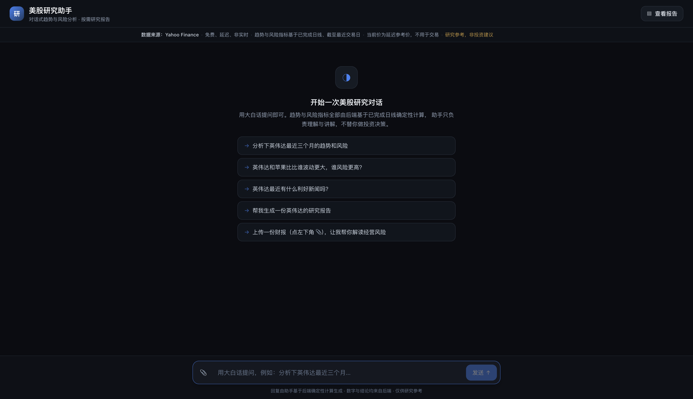
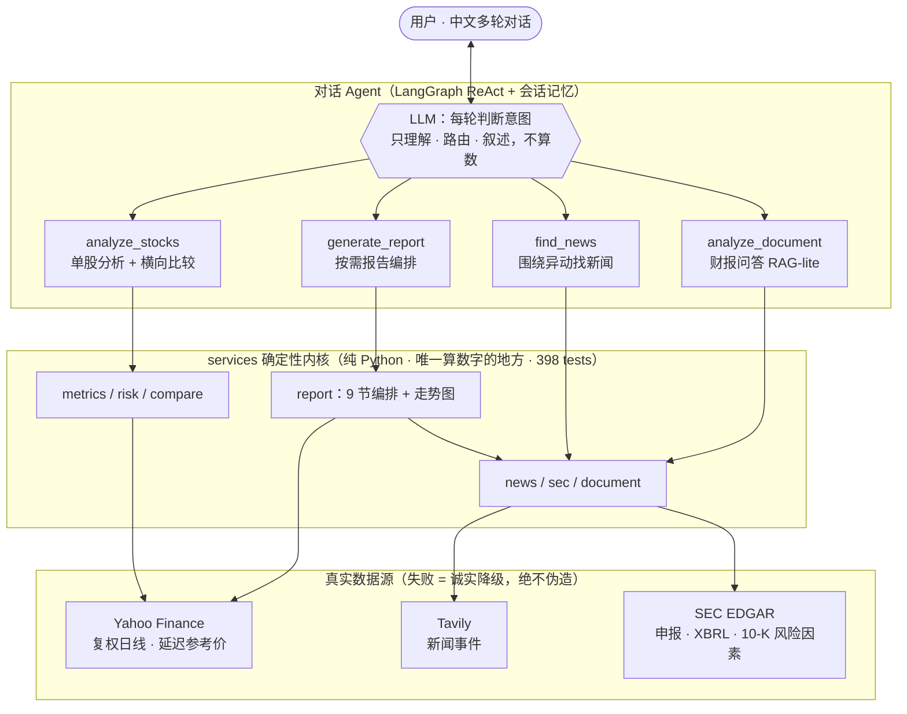

# Stock Deep Research Agent


对话式美股研究助手。用一句大白话提问，Agent 自动识别公司、获取行情、用确定性代码计算市场风险、围绕异动检索新闻证据、横向比较，并能按需产出**每只一份、可下载的英文研究报告**；还支持**上传一份财报文件**、基于其原文做问答。

> 核心设计约束一句话：**所有数字由确定性程序计算，模型只负责理解、路由与叙述——绝不算数、不编概率、不断因果。** 研究辅助工具，所有输出均声明「不构成投资建议」。



```text
帮我比较英伟达、阿里巴巴和英特尔最近三个月的表现，重点比较风险。
→（接着）英伟达最近有什么利好新闻吗？
→（接着）给英伟达和阿里巴巴各出一份研究报告。
→（上传 10-K 后）这份财报里最大的经营风险是什么？
```

---

## 能做什么

- **对话式分析**：识别中文/英文/代码 → 取 Yahoo Finance 日线 → 代码算区间收益、波动率、最大回撤、最大单日、市场风险等级；答案逐字流式输出。
- **横向比较**：1–3 只同口径对比、相对排名（并主动声明「仅限本次所选股票与区间」）。
- **异动找新闻**：先由代码识别显著异动日，再围绕这些时间点检索新闻证据——只呈现「时间接近、可能相关」，**绝不断言因果**。
- **按需报告**：每只股票一份独立的英文 9 节报告（归一化走势图、相关事件、SEC 财务与申报、**经营风险逐字提取**、短期市场观点、证据与限制 + 逐字免责声明），列表查看、单独下载；生成时**按股票分轨实时展示流水线各阶段进度**。
- **财报问答**：上传一份 PDF/TXT/MD 财报 → 上传即建内存向量索引（RAG-lite，进度可见）→ 先概述文件、再基于原文引用作答（带定位），文档未提及则如实说明。

## 架构



- **两层架构**：顶层对话 Agent 平时只做分析/比较/查新闻；**只有用户明确要报告时**才触发下层结构化编排（逐只固定流水线 → 汇总 → 排名 → 组装 9 节）。两层共用同一套确定性内核。
- **风险口径**（可配置、可复现、自洽样例反推单测）：`risk_score = vol_score×0.6 + drawdown_score×0.4`；绝对等级最严重优先（日波动率 ≥3% 或回撤 ≤−20% → High；≥1.5% / ≤−10% → Medium；数据不足 → Undetermined 且不参与排名）。结论命名为 **Observed Market Risk**——只凭股价只能评「观察到的市场价格风险」，不冒充综合投资风险。
- **流式**：`POST /chat/stream`（NDJSON）同一条流推送**流水线阶段事件**与**逐 token 答案**；交互式 API 文档见 `http://localhost:8000/docs`（FastAPI 自动生成）。

## 三条核心原则

1. **数字交给代码，理解交给模型** —— 收益率、波动率、最大回撤、风险分数等全部由确定性程序计算，模型不参与原始数值计算。
2. **只摆证据与相关性，绝不断言因果** —— 事件只说「时间接近、可能相关」，证据不足就说「无法确认」，绝不编造涨跌原因。
3. **来源与时间永远透明** —— 每个数字、结论、事件都带来源、数据时间与新鲜度；当前价标注「延迟参考价、不用于交易」。

---

## 技术栈

- **后端**：FastAPI · LangGraph（`create_react_agent` + 会话记忆）· LangChain/OpenAI（理解/叙述）· pandas/numpy（确定性指标）· matplotlib（走势图）· Jinja2（报告排版）· PyMuPDF（财报文本提取）· httpx。
- **前端**：Vite · React · TypeScript · Tailwind · react-markdown。
- **数据源**：Yahoo Finance（行情，免费无 key）· Tavily（新闻事件，可选）· SEC EDGAR（财务/申报/经营风险，可选）。

## 运行

**后端**（仅 `OPENAI_API_KEY` 必填；其余可选，缺失时对应能力诚实降级；缺核心 key 则 fail-fast 拒绝启动，绝不用假数据兜底）：

```bash
cp .env.example .env     # 填入 OPENAI_API_KEY（行情用 Yahoo Finance，无需 key）
python3.11 -m venv .venv && ./.venv/bin/pip install -r backend/requirements.txt
cd backend && ../.venv/bin/uvicorn app:app --port 8000   # API 文档: http://localhost:8000/docs
```

**前端**：

```bash
cd frontend && npm install && npm run dev   # 打开 http://localhost:5173
```

**测试**（全部离线确定性，注入 fake 数据源 / fake LLM）：

```bash
cd backend && ../.venv/bin/python -m pytest -q   # 398 passed
```

---

## 项目结构

```
.
├── backend/                      # FastAPI 应用 + 确定性 services + 工具/agent
│   ├── app.py  agent.py  tools.py  prompts.py  config.py  models.py
│   └── services/                 # market_data / metrics / risk / compare / report / news / sec / document …
├── frontend/                     # Vite + React 对话与报告界面
├── .harness/changes/phase-1-mvp/ # 设计文档（PRD · spec · plan · tasks）
├── docs/                         # README 配图
└── .env.example
```

## 边界与限制

- 覆盖美国上市股票与 ADR；不含 A 股、纯港股、加密、OTC 粉单。
- 单次最多 3 只股票、最长 1 年；上传单个财报文件；扫描件无可提取文本时如实报错（不做 OCR）。
- 风险结论为「观察到的市场价格风险（Observed Market Risk）」，不等于整家公司的综合投资风险。
- 仅供研究参考，**不构成投资建议、买卖推荐或收益承诺**；事件与价格的时间相关性不代表因果。

## License

[MIT](LICENSE)
