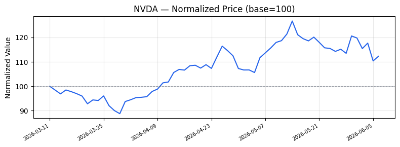

---

# NVDA — NVIDIA Corporation

## Company Snapshot

| Field | Value |
|---|---|
| **Company** | NVIDIA Corporation |
| **Symbol** | NVDA |
| **Exchange** | NASDAQ |
| **Instrument** | common |
| **Market** | US |
| **Analysis Period** | 最近 90 天 |
| **Data Coverage** | 100.0% (62/62 trading days) |
| **Calculation Basis** | Price Return (split-adjusted close prices) |

## Price Trend

**Observation period**: 最近 90 天

**Normalized price series (base = 100)**:

| Date | Normalized Value (base=100) |
|---|---|
| 2026-03-11 | 100.00 |
| 2026-03-19 | 95.98 |
| 2026-03-27 | 90.05 |
| 2026-04-07 | 95.74 |
| 2026-04-15 | 106.90 |
| 2026-04-23 | 107.32 |
| 2026-05-01 | 106.68 |
| 2026-05-11 | 117.96 |
| 2026-05-19 | 118.59 |
| 2026-05-28 | 115.17 |
| 2026-06-05 | 110.38 |
| 2026-06-08 | 112.28 |

| Metric | Value |
|---|---|
| **Period Return** | 12.28% |
| **Period High (adj. close)** | 235.47 |
| **Period Low (adj. close)** | 164.98 |
| **Up Days** | 32 |
| **Down Days** | 29 |

## Observed Market Risk

| Metric | Value |
|---|---|
| **Annualized Volatility** | 40.03% |
| **Daily Volatility** | 2.52% |
| **Negative-Day Volatility** | 23.59% (annualized, negative days only) |
| **Max Drawdown** | -12.90% |
| **Max Single-Day Move** | 6.26% (significant) |
| **Risk Score** | 47.44 |
| **Absolute Risk Level** | Medium |
| **Relative Rank** | N/A (single stock or insufficient data) |
| **Data Coverage** | 100.0% |
| **Observation Period** | 最近 90 天 |

> *Observed Market Risk reflects recent price behavior only; not the company's overall investment risk.*

## Significant Move

The largest single-day move in this period was **6.26%**
on 2026-06-01.
This exceeds the ±2% significance threshold.

## Related Events

Not available in this version.

## Financial & Filing Highlights

Not available in this version.

## Business Risks

Not available in this version.

## Short-term Market View

**View**: Positive

| Factor | Value |
|---|---|
| **Risk Level** | Medium |
| **Period Return** | 12.28% |
| **Return Threshold** | ±8.59% |

> *This is an observed market behavior summary, not an investment recommendation or return forecast.*

## Evidence & Limitations

- Data source: Yahoo Finance — free, delayed (not real-time); split-adjusted daily close prices.
- Analysis period: 最近 90 天 (62 effective trading days).
- Data coverage: 100.0%.
- Related Events, Financial & Filing Highlights, and Business Risks sections are not available in this version.
- All metrics are computed deterministically from price data only; they do not incorporate fundamental analysis, news sentiment, or forward-looking estimates.
- Risk scores are relative within the selected stocks and period only; they do not represent absolute investment risk.

---

## Disclaimer

This report is generated from market data and public information within the specified period, for information aggregation and research reference only. It does not constitute investment advice, a buy/sell recommendation, or any return guarantee. Temporal correlation between events and price changes does not prove causation. Market prices can change rapidly; please make independent decisions based on your own risk tolerance and after consulting a professional.